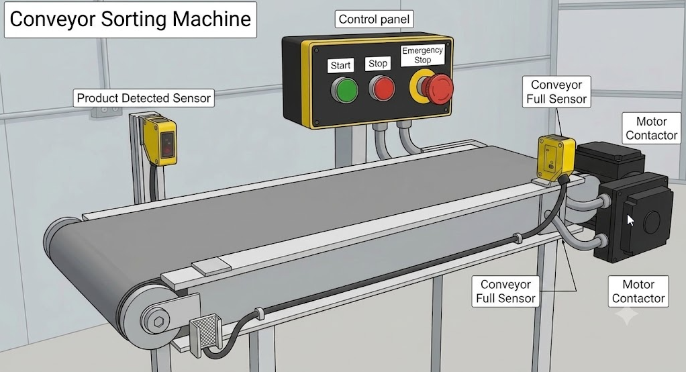

# TwinCAT 3 OOP Training
A two-part OOP training for TwinCAT 3 PLC programmers. Open `OOP/OOP.sln` in TwinCAT XAE (3.1.4026.20+) to load all projects.

- Part 1 - Introduction: Procedural to OOP, a light introduction for programmers used to conventional PLC programming styles.
- Part 2 - Framework OOP: an advanced follow up to part 1 for gradually building a company programming standard.

---

## Part 1 — Introduction: Procedural to OOP
A light introduction based on two video tutorials by Ben Harrison (Beckhoff Australia / Coding Bytes). The same conveyor sorting machine logic is implemented twice — first as flat procedural code, then refactored step by step into clean object-oriented code using interfaces and dependency injection.

### The Machine


A conveyor sorting machine with a start/stop control panel and two sensors:

```plaintext
[E-Stop (NC)] [Stop (NC)] [Start (NO)]    <- Control panel

         ┌─────────────────────────────┐
[Product]──► [Product Detected (NC)]   │   Conveyor Belt   ──► [Next Conveyor]
         │                             │                         [Full Sensor (NC)]
         └──────────[Motor]────────────┘

```
**Behaviour:** When in run mode, product on the belt triggers the motor for at least 5 seconds (off-delay timer). The motor stops if the downstream conveyor is full. Stop or E-Stop kill run mode immediately.

### Projects
| Project | Folder | Style |
| --- | --- | --- |
| PLC_NoOOP | OOP/OOP/PLC_NoOOP | Procedural — raw BOOL variables in GVL, all logic flat in MAIN |
| PLC_OOP | OOP/OOP/PLC_OOP | OOP — classes, interfaces, dependency injection, two-line MAIN |

### Documentation
| Document | Contents |
| --- | --- |
| [Training: Create the Procedural Program](doc/introduction/training-create-procedural-program.md) | Step-by-step guide to building `PLC_NoOOP` from scratch |
| [Training: Procedural to OOP](doc/introduction/training-procedural-to-oop.md) | Theory, paradigm shift, and step-by-step refactoring guide based on the video transcripts |
| [Code Reference](doc/introduction/code-reference.md) | Architecture, Mermaid class diagrams, line-by-line walkthrough of `PLC_NoOOP` and `PLC_OOP` |

### Credits
Original tutorial videos by **Ben Harrison** — Beckhoff Australia / Coding Bytes

- [OOP Introduction — Part 1](https://beckhoff-au.teachable.com/courses/1204788/lectures/30170060)
- [OOP Introduction — Part 2](https://beckhoff-au.teachable.com/courses/1204788/lectures/30173203)
Transcripts of both videos are in the `Transcript/` folder.

---

## Part 2 — Framework OOP: Building a Company Programming Standard
The natural next step for programmers who have completed Part 1 and want to level up to professional-grade OOP development. This series addresses a challenge every growing engineering team faces: as projects multiply and teams expand, inconsistent code becomes a liability. Bugs are harder to find, reuse is accidental rather than deliberate, and onboarding new programmers takes far too long.

The answer is a **company programming standard** — a shared library of well-designed, thoroughly tested base classes and interfaces that every programmer in the company builds on. When done right, machine-specific code becomes thin and expressive, common behaviour lives in one place, and the whole team speaks the same language.

This series builds that library from scratch. Students work through real machine problems and discover their solutions through established design patterns (Strategy, Observer, Proxy, Decorator, Registry, Template Method, and more). The emphasis is on clean code principles, SOLID design, and creating objects that are easy to maintain, extend, and hand over to colleagues.

### Project
| Project | Folder | Style |
| --- | --- | --- |
| PLC_FrameworkOOP | OOP/OOP/PLC_FrameworkOOP | Framework OOP — company base-class library built step by step |

### Documentation
| Document | Contents |
| --- | --- |
| [Framework Overview](doc/advanced/framework-overview.md) | Overview of the exercise series and learning objectives |
| [TwinCAT Coding Style](doc/advanced/TwinCAT-coding-style.md) | Architecture model, type system, class rules, naming conventions, and pragmas |

### Exercises
| # | Title | Key Concepts |
| --- | --- | --- |
| 01 | [Digital Input Classes](doc/advanced/exercise-01-digital-input.md) | OOP class vs IEC FB, encapsulation, abstraction, interface as contract |
| 02 | [Base Class and Inheritance](doc/advanced/exercise-02-base-class-inheritance.md) | Abstract class, `FB_Init` constructor, instance path |
| 03 | [Dependency Injection and the Logger](doc/advanced/exercise-03-dependency-injection.md) | SOLID D, Strategy pattern, null-safe fallback |
| 03a | [Severity Levels](doc/advanced/exercise-03a-severity-levels.md) | `TcEventSeverity`, parameter list vs constant *(described, not implemented)* |
| 03b | [Observer Pattern and Multi-Destination Logging](doc/advanced/exercise-03b-observer-pattern.md) | Subject/Observer, MQTT *(described, not implemented)* |
| 04 | [Proxy and Decorator](doc/advanced/exercise-04-proxy-decorator.md) | `BoolForceable`, inheritance-based Proxy, forcing pipeline |
| 04a | [`BoolForceable` Without the Intermediate Class](doc/advanced/exercise-04a-bool-forceable-simplified.md) | YAGNI, removing premature abstraction *(described, not implemented)* |
| 05 | [Registry and Self-Registration](doc/advanced/exercise-05-registry-self-registration.md) | Registry pattern, self-registration, HMI bridge |
| 06 | [Polymorphism](doc/advanced/exercise-06-polymorphism.md) | Interface arrays, single-loop dispatch, Liskov Substitution Principle |
| 07 | [Template Method](doc/advanced/exercise-07-template-method.md) | Abstract base class, abstract properties, enforced invariants |
| 10 | [Summary, Code Review, and Outlook](doc/advanced/exercise-10-summary-and-outlook.md) | Pattern recap, code audit, production roadmap |
| 10a | [Final Exam](doc/advanced/exercise-10a-exam.md) | 20 questions across concepts, code reading, design, and critical thinking |