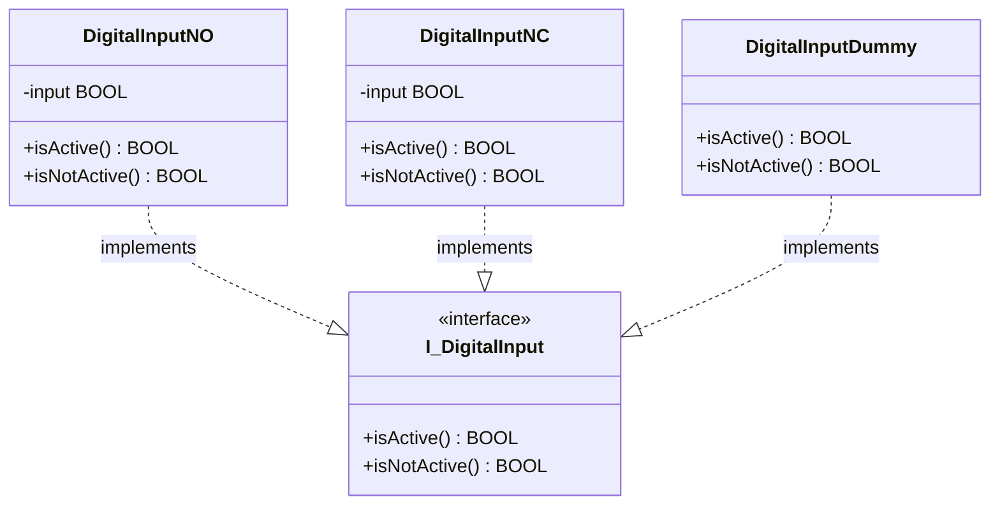

# Exercise 01 — Digital Input Classes

## Introduction
This is the first exercise in the framework series. It introduces the idea that a PLC function block can be written as a proper **class** rather than a traditional IEC 61131-3 function block, and it shows the first two OOP pillars — **encapsulation** and **abstraction** — applied to the simplest hardware element you will find on any machine: a digital input.

By the end of this exercise you will have:

- An interface `I_DigitalInput` that defines the contract every digital input class must fulfil
- Two concrete classes `DigitalInputNO` and `DigitalInputNC` for physically wired inputs
- One placeholder class `DigitalInputDummy` for inputs whose type has not yet been decided
- A demonstration program `DevicesExample` that calls all three through the same property names

---

## Concepts Introduced

### 1. OOP class vs IEC 61131-3 function block
A traditional function block mixes declaration and behaviour: inputs arrive in `VAR_INPUT`, outputs leave in `VAR_OUTPUT`, and the body runs every scan. This scan-cycle coupling makes it hard to reason about the object in isolation.

A **class** in this framework is a function block that:

- Has **no VAR_INPUT / VAR_OUTPUT** — it owns its own state
- Has **no code in the body** — all behaviour lives in methods and properties
- Is **never called directly** — the compiler enforces this with a pragma

Two pragmas mark every class in this framework:

```iecst
{attribute 'no_explicit_call' := 'DigitalInputNO is a class, do not call this POU directly, use a method'}
{attribute 'hide_all_locals'}
FUNCTION_BLOCK DigitalInputNO IMPLEMENTS I_DigitalInput

```

`no_explicit_call` tells the compiler to produce an error if anyone writes `noInput()` in their code. The error message is the string you supply — make it instructive.

`hide_all_locals` removes internal variables from the watch window and online view. The consumer sees only what the class exposes through its interface — nothing about the internal wiring.

**Declaration section rules — two hard rules for every class in this framework:**

*Rule 1 — No VAR_INPUT, VAR_OUTPUT, or VAR_IN_OUT.* These sections belong to the IEC 61131-3 function block model where data flows through the call interface. A class owns its own state and exposes behaviour exclusively through methods and properties. If TwinCAT adds these stubs automatically when you create a function block, delete them immediately.

*Rule 2 — Remove empty VAR blocks.* If a declaration section contains no variables, delete the entire block. An empty `VAR / END_VAR` adds noise and signals an unfinished declaration. Only write a VAR block when it has at least one variable in it.

### 2. Encapsulation
The raw hardware variable is hidden inside the class:

```iecst
VAR
    input AT %I* : BOOL;
END_VAR

```

Nothing outside `DigitalInputNO` can read or write `input` directly. The I/O mapping address is an internal implementation detail. Code that uses the class never needs to know whether the signal comes from hardware, a simulation, or a dummy.

### 3. Abstraction — choosing the right property names
A digital input is, at its simplest, something that is either **active** or **not active**. That is the only abstraction the rest of the program should need.

The interface defines two properties:

```iecst
PROPERTY isActive    : BOOL
PROPERTY isNotActive : BOOL

```

These names are chosen deliberately. Alternatives that reveal implementation or assumption:

| Name | Problem |
| --- | --- |
| isHigh / isLow | Reveals voltage level — hardware detail |
| isOpen / isClosed | Reveals wiring type — hardware detail |
| isPressed | Only meaningful for buttons, not sensors |
| hasBeenActivated | Implies state history — wrong abstraction |
| isDown / isUp | Reveals physical mounting direction |

`isActive` and `isNotActive` are neutral. They work correctly whether the signal is from a start button, a pressure switch, a light barrier, or a proximity sensor — and whether the physical wiring is normally open or normally closed.

This principle is from Robert C. Martin's *Clean Code*: **names should reveal intent, not implementation.**

### 4. Interface as a contract
An interface in TwinCAT Structured Text is a `.TcIO` file that declares properties and methods without implementing them:

```iecst
INTERFACE I_DigitalInput
    PROPERTY isActive    : BOOL
    PROPERTY isNotActive : BOOL

```

`I_DigitalInput` is the **contract**. It says: any class that claims to be a digital input must provide these two properties. The consumer writes code against `I_DigitalInput`; it does not matter which concrete class sits behind the reference at runtime.

Every concrete class declares the contract it fulfils:

```iecst
FUNCTION_BLOCK DigitalInputNO IMPLEMENTS I_DigitalInput

```

If the class is missing a property the interface requires, the compiler reports an error. The interface is enforced at compile time, not at runtime.

### 5. The placeholder class — `DigitalInputDummy`
During development it is common to reach a point where a hardware decision has not been made yet: the wiring type is unknown, the sensor has not been selected, or the I/O card is not available. `DigitalInputDummy` is a placeholder for exactly that situation.

```iecst
PROPERTY isActive    : BOOL  →  isActive    := TRUE;
PROPERTY isNotActive : BOOL  →  isNotActive := TRUE;

```

Both properties return `TRUE`. This is intentional: `DigitalInputDummy` is **permissive**. Any code that reads `isActive` or `isNotActive` gets `TRUE` and continues to execute. The placeholder lets the rest of the program run and be tested without blocking on a missing hardware decision.

This does mean `DigitalInputDummy` is logically inconsistent — a real input cannot be active and not-active at the same time. This is a known design trade-off. In a future exercise, `DigitalInputDummy` will generate a compiler or runtime warning so the programmer is reminded to replace it before shipping.

---

## Architecture



`DigitalInputDummy` has no `input` variable because it has no hardware mapping. It only satisfies the interface contract.

---

## Step-by-Step Guide

### Prerequisites

- TwinCAT XAE open with the `PLC_FrameworkOOP` project loaded
- Read the [TwinCAT-coding-style](TwinCAT-coding-style.md) before you start — they apply to every step below

---

### Step 1 — Create the `Devices` folder
In Solution Explorer, right-click the `PLC_FrameworkOOP` PLC project node → **Add** → **Folder**. Name it `Devices`.

All device-level classes live here. A folder in TwinCAT is a pure organisational tool — it has no effect on compilation or namespacing.

---

### Step 2 — Create the interface `I_DigitalInput`
Right-click the `Devices` folder → **Add** → **Interface**.

Name: `I_DigitalInput`

> **Naming rule:** Interfaces are named with `I` followed by a Capitalized noun or noun phrase. `I_DigitalInput` describes what the implementer *is*, not what prefix it carries.

Add two read-only properties to the interface:

```iecst
INTERFACE I_DigitalInput

PROPERTY isActive    : BOOL
PROPERTY isNotActive : BOOL

```

> An interface only declares the **signature** of each property. There is no implementation here — that is the point. The interface is the contract; the concrete classes are the implementations.

Do not add a getter body. TwinCAT creates the `Get` stub automatically; leave it empty in the interface file.

---

### Step 3 — Create `DigitalInputNO` (Normally Open)
Right-click `Devices` → **Add** → **Function Block**. Name: `DigitalInputNO`.

Add the two class pragmas at the very top of the declaration, then declare the hardware input variable:

```iecst
{attribute 'no_explicit_call' := 'DigitalInputNO is a class, do not call this POU directly, use a method'}
{attribute 'hide_all_locals'}
FUNCTION_BLOCK DigitalInputNO IMPLEMENTS I_DigitalInput
VAR
    input AT %I* : BOOL;
END_VAR

```

Leave the body completely empty.

Now add the `isActive` property (right-click the POU → **Add** → **Property**):

```iecst
// isActive getter
isActive := input;

```

Add the `isNotActive` property:

```iecst
// isNotActive getter
isNotActive := NOT input;

```

**Why this logic?** A normally open contact is open at rest, so the hardware input reads `FALSE` when the device is inactive. When the device activates, the contact closes and the input reads `TRUE`. `isActive := input` maps directly to that physical behaviour.

---

### Step 4 — Create `DigitalInputNC` (Normally Closed)
Repeat Step 3. Name: `DigitalInputNC`. The only difference is the property logic — a normally closed contact is closed at rest, so the hardware input reads `TRUE` when the device is inactive, and `FALSE` when it activates:

```iecst
// isActive getter
isActive := NOT input;

// isNotActive getter
isNotActive := input;

```

The consumer of `DigitalInputNC` never sees this inversion. They still call `isActive` and get a `TRUE` when the device is active. The hardware polarity is fully hidden inside the class.

---

### Step 5 — Create `DigitalInputDummy`
Right-click `Devices` → **Add** → **Function Block**. Name: `DigitalInputDummy`.

```iecst
{attribute 'no_explicit_call' := 'DigitalInputDummy is a class, do not call this POU directly, use a method'}
{attribute 'hide_all_locals'}
FUNCTION_BLOCK DigitalInputDummy IMPLEMENTS I_DigitalInput

```

No `VAR` block — `DigitalInputDummy` has no hardware mapping.

Both properties return `TRUE`:

```iecst
// isActive getter
isActive := TRUE;

// isNotActive getter
isNotActive := TRUE;

```

> `DigitalInputDummy` is a **permissive placeholder**. Both properties return `TRUE` so any code that reads either property will continue to execute. Use it wherever a hardware decision has not been made yet. Replace it with `DigitalInputNO` or `DigitalInputNC` once the wiring is known.

>

> The logical inconsistency (active AND not-active both true) is intentional. `DigitalInputDummy` does not model a real signal — it models the *absence of a decision*.

---

### Step 6 — Create the demonstration program `DevicesExample`
Right-click `Devices` → **Add** → **Program**. Name: `DevicesExample`.

> **Naming rule:** Programs are Capitalized noun phrases. No `PRG_` prefix — the style guide does not use type tags for programs.

```iecst
PROGRAM DevicesExample
VAR
    noInput      : DigitalInputNO;
    ncInput      : DigitalInputNC;
    dummyInput   : DigitalInputDummy;

    noActive     : BOOL;
    ncActive     : BOOL;
    dummyActive  : BOOL;

    noNotActive    : BOOL;
    ncNotActive    : BOOL;
    dummyNotActive : BOOL;
END_VAR

noActive    := noInput.isActive;
ncActive    := ncInput.isActive;
dummyActive := dummyInput.isActive;

noNotActive    := noInput.isNotActive;
ncNotActive    := ncInput.isNotActive;
dummyNotActive := dummyInput.isNotActive;

```

> **Variable naming rule:** Object instances are camelCase noun phrases — `noInput`, `ncInput`, `dummyInput`. Local result variables are also camelCase.

---

### Step 7 — Call `DevicesExample` from `MAIN`
Open `MAIN`:

```iecst
PROGRAM MAIN

DevicesExample();

```

Calling a program by name gives it a scan cycle. `MAIN` contains no logic — it only schedules which programs run.

---

## What to Observe in Online View
After building and activating the configuration:

1. Open the `DevicesExample` instance in online view
2. Toggle the physical hardware input mapped to `noInput` — `noActive` flips `FALSE → TRUE` and `noNotActive` flips `TRUE → FALSE` simultaneously
3. Toggle the same signal mapped to `ncInput` — `ncActive` and `ncNotActive` move in the opposite direction to `noInput` for the same physical signal state
4. Observe `dummyActive` and `dummyNotActive` — both are always `TRUE` regardless of any hardware state

Points 2 and 3 show that `isActive` and `isNotActive` are always logical inverses of each other for real hardware classes. The consumer never writes `NOT input` — the class handles the inversion internally, and the property name communicates intent.

Point 4 shows the intentional inconsistency of `DigitalInputDummy`: both properties return `TRUE` at the same time. This would be impossible on real hardware but is the deliberate behaviour of the permissive placeholder — it never blocks code flow.