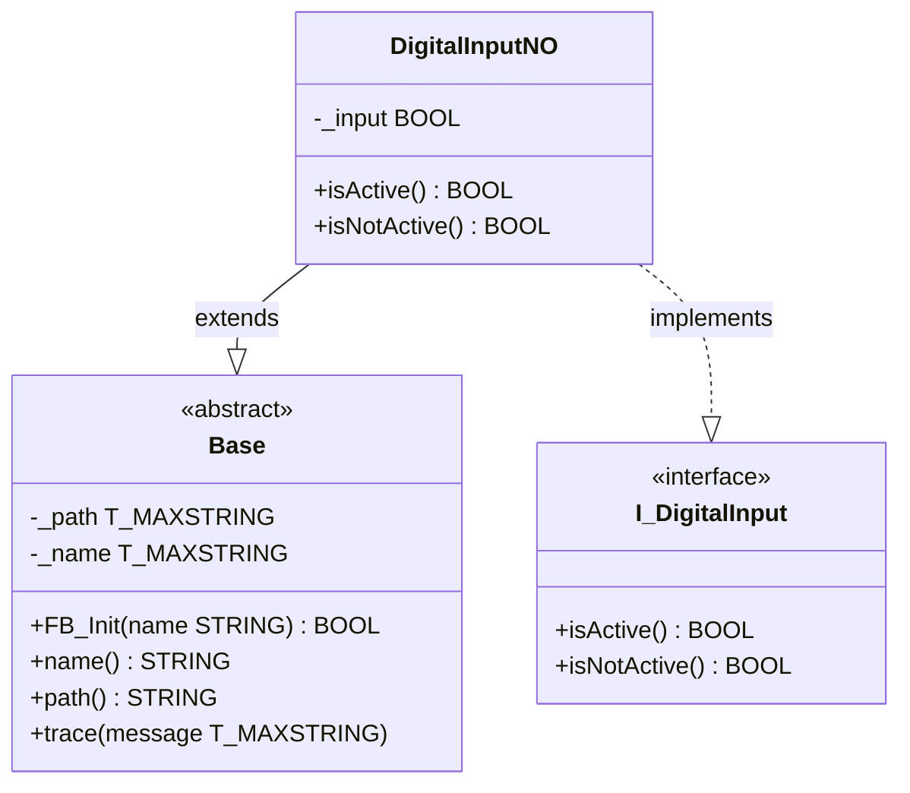

# Exercise 02 — Base Class and Inheritance

## Introduction

Exercise 01 introduced classes and interfaces in isolation. Every class knew how to behave (`isActive`, `isNotActive`), but none of them shared any common infrastructure. In practice, every object in a framework needs a minimum set of capabilities: a human-readable name, a way to locate itself at runtime, and a way to emit diagnostic messages. Copying that infrastructure into every class would be repetitive and hard to maintain.

This exercise introduces the **base class**: a single abstract class that provides shared infrastructure, which any other class can inherit. It also introduces **inheritance** as the mechanism, and **`FB_Init`** as TwinCAT's constructor — the place where an object is given its identity at the moment it is created.

---

## Concepts Introduced

### 1. Abstract class

An abstract class is a class that **cannot be instantiated directly**. It exists only to be extended by other classes. In TwinCAT Structured Text, the `ABSTRACT` keyword enforces this:

```iecst
FUNCTION_BLOCK ABSTRACT Base
```

Attempting to declare a variable of type `Base` directly will produce a compiler error. The only way to use `Base` is to create a class that `EXTENDS` it.

Abstract classes are the right tool for shared infrastructure: you define the common members once, and every subclass gets them automatically. The base class can also declare abstract methods — methods with no implementation that every subclass is required to provide. This exercise does not yet use abstract methods; they appear in a later exercise.

### 2. Inheritance — `EXTENDS`

Inheritance lets a class take over all members of a parent class and add its own on top:

```iecst
FUNCTION_BLOCK DigitalInputNO EXTENDS Base IMPLEMENTS I_DigitalInput
```

`DigitalInputNO` now has everything `Base` has — `_name`, `_path`, `FB_Init`, `name`, `path`, and `trace` — plus its own `_input` variable and `isActive` / `isNotActive` properties.

The relationship reads: **DigitalInputNO is a Base**. This is the defining characteristic of inheritance. Use it when the subclass genuinely *is a* specialisation of the parent, not just when you want to reuse some code.

The `Base` class is optional infrastructure — classes are not required to extend it. If a class has no need for a name, a path, or tracing, it does not have to inherit from `Base`.

### 3. Constructor — `FB_Init`

`FB_Init` is TwinCAT's constructor method. It is called implicitly by the runtime when an instance is created — before the first scan cycle runs. You never call `FB_Init` explicitly in your code; you pass its arguments inline in the variable declaration:

```iecst
noInput : DigitalInputNO('I201.1');
```

The string `'I201.1'` is passed to the `name` parameter of `Base.FB_Init`. This gives the instance a logical, human-readable name that the programmer chooses — something meaningful to the person reading the code or watching the diagnostics.

`FB_Init` always receives two standard TwinCAT parameters in addition to any custom ones:

| Parameter | Meaning |
|-----------|---------|
| `bInitRetains` | `TRUE` when retain variables are being reinitialised (warm/cold reset) |
| `bInCopyCode` | `TRUE` when the instance is being copied during an online change |

These are framework-level signals from the TwinCAT runtime. Your constructor code can check them if needed; in most cases they are received and ignored.

Because `FB_Init` is a **method**, it is allowed to have `VAR_INPUT` — that is how method parameters work. The rule that classes never use `VAR_INPUT` in their declaration applies to the function block body, not to methods inside it.

> **Inheritance and constructors:** Because `DigitalInputNO` does not declare its own `FB_Init`, it inherits the one from `Base`. The string passed at instantiation goes directly to `Base.FB_Init`. If a subclass needs additional constructor logic, it declares its own `FB_Init` with the same parameters — TwinCAT automatically calls the entire base chain first (`Base.FB_Init` → … → derived `FB_Init` body), so no explicit `SUPER^.FB_Init` call is needed or correct. Adding one would invoke the base constructor a second time. See [Beckhoff Infosys — FB_init, FB_reinit and FB_exit](https://infosys.beckhoff.com/english.php?content=../content/1033/tc3_plc_intro/5482088715.html&id=) for the authoritative description of this call sequence.

### 4. Instance path — reflection

`Base` stores two strings that identify an object at runtime:

```iecst
{attribute 'reflection'}
FUNCTION_BLOCK ABSTRACT Base
VAR
    {attribute 'instance-path'}
    {attribute 'noinit'}
    _path : T_MAXSTRING;

    _name : T_MAXSTRING;
END_VAR
```

| Attribute | Effect |
|-----------|--------|
| `{attribute 'reflection'}` | Enables TwinCAT's reflection system for this class. Required for `instance-path` to work. |
| `{attribute 'instance-path'}` | TwinCAT automatically fills `_path` with the full instance path of the object at runtime — e.g. `PLC_FrameworkOOP.DevicesExample.noInput`. |
| `{attribute 'noinit'}` | Tells the runtime not to zero-initialise this variable; its value is set by the reflection system instead. |

The **path** is automatic — it is determined by where in the program the instance is declared and requires no programmer input. The **name** is intentional — it is given by the programmer at instantiation and should describe what the object represents in the application, not where it sits in the code.

Together, `name` and `path` answer two different diagnostic questions:
- *What is this object?* → `name` (e.g. `'I201.1'`)
- *Where is this object in the program?* → `path` (e.g. `DevicesExample.noInput`)

### 5. `trace`

```iecst
METHOD trace
VAR_INPUT
    message : T_MAXSTRING;
END_VAR

ADSLOGSTR(msgCtrlMask := ADSLOG_MSGTYPE_HINT, msgFmtStr := message, strArg := '');
```

`trace` sends a string message to the TwinCAT ADS event logger, visible in the XAE event window during online operation. Every class that extends `Base` inherits `trace` and can call it from any of its own methods without any additional wiring.

This is the beginning of a diagnostic layer built into the framework itself — any object can report what it is doing without the program needing to know about a separate logging system.

---

## Architecture

The diagram below shows `DigitalInputNO` as the example. `DigitalInputNC` and `DigitalInputDummy` have the same relationship with `Base` and `I_DigitalInput`.



`DigitalInputNO` does not redeclare `name`, `path`, `FB_Init`, or `trace`. It inherits them from `Base`. It only adds what is unique to a normally-open digital input: the hardware-mapped `_input` variable and the two property implementations.

---

## Step-by-Step Guide

### Prerequisites

- Exercise 01 completed — `Devices` folder with `I_DigitalInput`, `DigitalInputNO`, `DigitalInputNC`, `DigitalInputDummy`, and `DevicesExample` in place
- [TwinCAT coding style](TwinCAT-coding-style.md) at hand

---

### Step 1 — Create the `Base` folder

In Solution Explorer, right-click the `PLC_FrameworkOOP` project node → **Add** → **Folder**. Name it `Base`.

The `Base` folder sits at the project root alongside `Devices`. As the framework grows, other folders (Actuators, Modules, …) will appear at the same level.

---

### Step 2 — Create the `Base` function block

Right-click `Base` → **Add** → **Function Block**. Name it `Base`.

Replace the entire declaration with:

```iecst
{attribute 'no_explicit_call' := 'Base is a class, do not call this POU directly, use a method'}
{attribute 'hide_all_locals'}
{attribute 'reflection'}
FUNCTION_BLOCK ABSTRACT Base
VAR
    {attribute 'instance-path'}
    {attribute 'noinit'}
    _path : T_MAXSTRING;

    _name : T_MAXSTRING;
END_VAR
```

Three things to note in this declaration:

**`ABSTRACT`** — the class cannot be instantiated on its own. It must be extended.

**`{attribute 'reflection'}`** — must appear on the function block itself to activate TwinCAT's reflection system. Without it, the `instance-path` attribute on `_path` has no effect.

**`_path` with two attributes** — `instance-path` tells TwinCAT to populate this variable automatically; `noinit` tells TwinCAT not to overwrite it with a zero during initialisation. Both attributes are required together.

The leading underscore on `_path` and `_name` is a convention: private member variables that are only accessible through a property are prefixed with `_`. The property exposes the value; the raw variable stays hidden.

Leave the body empty.

---

### Step 3 — Add the `FB_Init` constructor method

Right-click the `Base` POU → **Add** → **Method**. Name it `FB_Init`. Return type: `BOOL`.

Declaration:

```iecst
METHOD FB_Init : BOOL
VAR_INPUT
    bInitRetains : BOOL;
    bInCopyCode  : BOOL;
    name         : STRING;
END_VAR
```

Body:

```iecst
_name := name;
```

`bInitRetains` and `bInCopyCode` are mandatory — TwinCAT always passes them and the method signature must include them. Your code does not have to use them.

`name` is the custom parameter. The programmer supplies it at instantiation (`DigitalInputNO('I201.1')`), and the constructor stores it for later retrieval via the `name` property.

---

### Step 4 — Add the `name` and `path` properties

Right-click `Base` → **Add** → **Property**. Name: `name`, type: `STRING`. Implement the GET accessor only:

```iecst
name := _name;
```

Repeat for `path`:

```iecst
path := _path;
```

Both are read-only. There is no reason for external code to overwrite the name or path after construction — the name is set once in `FB_Init` and the path is set once by the runtime.

---

### Step 5 — Add the `trace` method

Right-click `Base` → **Add** → **Method**. Name: `trace`.

Declaration:

```iecst
METHOD trace
VAR_INPUT
    message : T_MAXSTRING;
END_VAR
```

Body:

```iecst
ADSLOGSTR(msgCtrlMask := ADSLOG_MSGTYPE_HINT, msgFmtStr := message, strArg := '');
```

`ADSLOGSTR` is a function from the `Tc2_System` library (already referenced in the project). It sends `message` to the TwinCAT ADS logger as a hint-level event. The message appears in the XAE event window during online operation.

---

### Step 6 — Update the DI classes to extend `Base`

Open `DigitalInputNO`. Change the declaration line:

```iecst
FUNCTION_BLOCK DigitalInputNO EXTENDS Base IMPLEMENTS I_DigitalInput
```

Repeat for `DigitalInputNC` and `DigitalInputDummy`. No other changes are needed in these classes — inheritance is declared in one line and the rest follows automatically.

---

### Step 7 — Extend `DevicesExample` with Base properties and `trace`

Open `DevicesExample`. Add variables for `name`, `path`, and a `trace` trigger to the declaration:

```iecst
PROGRAM DevicesExample
VAR
    noInput         : DigitalInputNO('I201.1');
    ncInput         : DigitalInputNC('I201.2');
    dummyInput      : DigitalInputDummy('Undefined IO');

    noActive        : BOOL;
    ncActive        : BOOL;
    dummyActive     : BOOL;

    noNotActive     : BOOL;
    ncNotActive     : BOOL;
    dummyNotActive  : BOOL;

    noName          : STRING;
    ncName          : STRING;
    dummyName       : STRING;

    noPath          : STRING;
    ncPath          : STRING;
    dummyPath       : STRING;

    traceAll        : BOOL;
    traceAllTrig    : R_TRIG;
END_VAR
```

Add the corresponding body code below the existing `isActive` / `isNotActive` reads:

```iecst
noName    := noInput.name;
ncName    := ncInput.name;
dummyName := dummyInput.name;

noPath    := noInput.path;
ncPath    := ncInput.path;
dummyPath := dummyInput.path;

traceAllTrig(CLK := traceAll);
IF traceAllTrig.Q THEN
    noInput.trace(noInput.name);
    ncInput.trace(ncInput.name);
    dummyInput.trace(dummyInput.name);
END_IF
```

The string in parentheses at instantiation (`'I201.1'`) is passed to `Base.FB_Init` as the `name` argument. Choose a name that means something to the person reading the code or watching the diagnostics — an IO tag, a functional description, or a placeholder like `'Undefined IO'` for a dummy.

`traceAllTrig` detects the rising edge of `traceAll` so `trace` fires once per toggle rather than every scan. `R_TRIG` is a standard function block from `Tc2_Standard`.

---

## What to Observe in Online View

After building and activating the configuration:

1. Open the `DevicesExample` instance in online view
2. Toggle the physical hardware input mapped to `noInput` — `noActive` flips `FALSE → TRUE` and `noNotActive` flips `TRUE → FALSE` simultaneously
3. Toggle the same signal mapped to `ncInput` — `ncActive` and `ncNotActive` move in the opposite direction to `noInput` for the same physical signal state
4. Observe `dummyActive` and `dummyNotActive` — both are always `TRUE` regardless of any hardware state
5. Watch `noName`, `ncName`, `dummyName` — they show the constructor strings `'I201.1'`, `'I201.2'`, `'Undefined IO'`
6. Watch `noPath`, `ncPath`, `dummyPath` — TwinCAT has filled them automatically with the full instance paths (e.g. `DevicesExample.noInput`)
7. Force `traceAll` to `TRUE` then back to `FALSE` — one message per instance appears in the TwinCAT XAE event logger showing the name of each object

Points 2 and 3 show that `isActive` and `isNotActive` are always logical inverses of each other for real hardware classes. The consumer never writes `NOT input` — the class handles the inversion internally, and the property name communicates intent.

Point 4 shows the intentional inconsistency of `DigitalInputDummy`: both properties return `TRUE` at the same time. This would be impossible on real hardware but is the deliberate behaviour of the permissive placeholder — it never blocks code flow.

Points 5 and 6 show the two identity strings every `Base` subclass carries. `name` is set by the programmer at instantiation; `path` is filled automatically by the TwinCAT runtime. Together they answer the diagnostic questions *what is this object?* and *where is it in the program?*

Point 7 shows how `trace` carries that identity into the event logger — the message is the object's own name, so every log entry is self-identifying without any extra formatting code.
