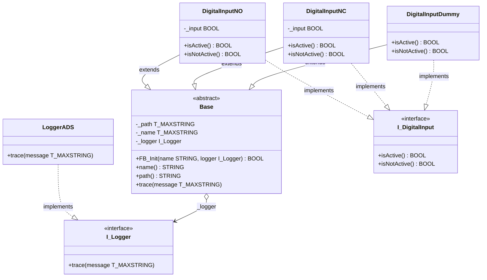

# Exercise 03 — Dependency Injection and the Central Logger

## Introduction

> *"I want to add a central logger that receives all trace messages from the Base instances. What would be the best approach?"*

This is exactly the right question to ask at this point in the framework. Exercise 02 gave every object a `trace` method — but that method hard-codes its output destination by calling `ADSLOGSTR` directly. Every instance always logs to the ADS event window, and there is no way to change that without modifying `Base` itself.

The solution is to make the logging destination a **dependency that is supplied from outside the class**, rather than one the class creates for itself. This is called **dependency injection**, and it is the practical application of one of the most important principles in software design.

By the end of this exercise you will have:

- `I_Logger` wired into `Base` as an injected dependency
- `Base.trace` calling the injected logger, with a fallback to `ADSLOGSTR` when none is supplied
- `LoggerADS` instantiated once in `DevicesExample` and passed to every input object at construction time

---

## Concepts Introduced

### 1. The problem with hard-coded dependencies

Before this exercise, `Base.trace` looks like this:

```iecst
ADSLOGSTR(msgCtrlMask := ADSLOG_MSGTYPE_HINT, msgFmtStr := message, strArg := '');
```

`Base` reaches out and grabs `ADSLOGSTR` directly. `Base` controls not just *what* it logs but *where* the message goes. This creates a hidden, hard-coded coupling between a high-level abstraction (`Base`) and a low-level mechanism (`ADSLOGSTR`). You cannot redirect logging to a file, a circular buffer, or a test spy without editing `Base`.

The Gang of Four captured this problem in a single principle:

> *"Program to an interface, not an implementation."*
> — Gamma, Helm, Johnson, Vlissides, *Design Patterns*, 1994

`ADSLOGSTR` is an implementation. `I_Logger` is an interface. `Base` should depend on the interface.

---

### 2. Two approaches — global singleton vs dependency injection

There are two common ways to give `Base` access to a logger. Understanding both — and why one is better — is more valuable than the code itself.

#### Approach A — Global singleton

Declare a global logger variable and call it directly from `Base.trace`:

```iecst
// GVL (global variable list)
VAR_GLOBAL
    G_Logger : LoggerADS;
END_VAR

// Base.trace
METHOD trace
VAR_INPUT
    message : T_MAXSTRING;
END_VAR
G_Logger.trace(message);
```

Simple. Zero wiring overhead. Every object in the entire program uses the same logger automatically.

The problem: `Base` now has an invisible dependency on `GVL.G_Logger`. Nothing in `Base`'s declaration tells you this dependency exists. You cannot give different objects different loggers. You cannot replace `LoggerADS` with a test double. And removing or renaming `G_Logger` silently breaks every class that extends `Base`.

Robert C. Martin names this the **Dependency Inversion Principle** (the D in SOLID):

> *"The Dependency Inversion Principle tells us that the most flexible systems are those in which source code dependencies refer only to abstractions, not to concretions."*
> — Robert C. Martin, *Clean Architecture*, 2017

The global singleton violates DIP in both directions: `Base` (high-level) depends on `LoggerADS` (low-level concretion), and the dependency is hidden rather than declared.

#### Approach B — Dependency injection

Pass the logger into `Base.FB_Init` as a parameter:

```iecst
// Base.FB_Init
METHOD FB_Init : BOOL
VAR_INPUT
    bInitRetains : BOOL;
    bInCopyCode  : BOOL;
    name         : STRING;
    logger       : I_Logger;
END_VAR
_name   := name;
_logger := logger;

// Base.trace
METHOD trace
VAR_INPUT
    message : T_MAXSTRING;
END_VAR
IF __ISVALIDREF(_logger) THEN
    _logger.trace(message);
ELSE
    ADSLOGSTR(msgCtrlMask := ADSLOG_MSGTYPE_HINT, msgFmtStr := message, strArg := '');
END_IF

// At instantiation in DevicesExample
logger    : LoggerADS;
noInput   : DigitalInputNO('I201.1', logger);
ncInput   : DigitalInputNC('I201.2', logger);
```

Now `Base` declares its dependency explicitly. Anyone reading `FB_Init` sees immediately that a logger is required. The logger can be swapped — `LoggerADS`, a file logger, a test double — without touching `Base` at all. And if no logger is passed, `trace` falls back to `ADSLOGSTR` so all existing code from exercises 01 and 02 continues to work unchanged.

**This is the approach implemented in this exercise.**

---

### 3. Dependency Inversion Principle

DIP has two rules:

1. High-level modules should not depend on low-level modules. Both should depend on abstractions.
2. Abstractions should not depend on details. Details should depend on abstractions.

Applied here:

| Role | Element |
|---|---|
| High-level module | `Base` — orchestrates object identity and diagnostics |
| Low-level module | `LoggerADS` — knows about `ADSLOGSTR` and TwinCAT's event system |
| Abstraction | `I_Logger` — defines the contract both sides agree on |

After this exercise, `Base` depends only on `I_Logger`. `LoggerADS` depends only on `I_Logger`. Neither depends on the other. The dependency arrow points *toward* the abstraction from both sides — hence **inversion**.

This also satisfies the **Open/Closed Principle** (the O in SOLID): `Base` is open for extension (you can inject any logger) but closed for modification (you never need to edit `Base` to add a new logging destination).

---

### 4. The null fallback — safe by default

The `__ISVALIDREF` check in `trace` serves two purposes. First, it makes the logger parameter genuinely optional: code that does not yet have a logger wired up continues to produce output via `ADSLOGSTR`. Second, it prevents a null-pointer call — calling a method on an invalid interface reference in TwinCAT causes a runtime exception.

The design rule is: **a class should be safe to use even when optional dependencies are absent.** The fallback is not the preferred path, it is the safety net.

---

### 5. This is the Strategy pattern

The Gang of Four describe the **Strategy** pattern as:

> *"Define a family of algorithms, encapsulate each one, and make them interchangeable. Strategy lets the algorithm vary independently from clients that use it."*
> — Gamma, Helm, Johnson, Vlissides, *Design Patterns*, 1994

The logging mechanism is the "algorithm". `I_Logger` encapsulates it. `LoggerADS`, and any future logger, are interchangeable strategies. `Base` is the client — it never changes regardless of which strategy is injected.

Dependency injection is the mechanism by which the Strategy pattern is wired up at construction time.

---

## Architecture



The hollow diamond on `Base o--> I_Logger` denotes aggregation: `Base` holds a reference to an `I_Logger` but does not own or create it. The instance is created outside `Base` and injected. `Base` and `LoggerADS` both point toward `I_Logger` — that is the inversion.

---

## Step-by-Step Guide

### Prerequisites

- Exercise 02 completed — `Base`, `I_DigitalInput`, `DigitalInputNO`, `DigitalInputNC`, `DigitalInputDummy`, and `DevicesExample` in place
- `I_Logger` interface and `LoggerADS` function block already created in the `Logger` folder
- [TwinCAT coding style](TwinCAT-coding-style.md) at hand

---

### Step 1 — Add `_logger` to `Base`

Open `Base`. Add the private logger reference to the `VAR` block:

```iecst
{attribute 'no_explicit_call' := 'Base is a class, do not call this POU directly, use a method'}
{attribute 'hide_all_locals'}
{attribute 'reflection'}
FUNCTION_BLOCK ABSTRACT Base
VAR
    {attribute 'instance-path'}
    {attribute 'noinit'}
    _path   : T_MAXSTRING;

    _name   : T_MAXSTRING;
    _logger : I_Logger;
END_VAR
```

`_logger` follows the private-member convention — underscore prefix, accessible only through the `trace` method.

---

### Step 2 — Update `FB_Init` to accept the logger

Open the `FB_Init` method. Add `logger : I_Logger` as the last input parameter:

```iecst
METHOD FB_Init : BOOL
VAR_INPUT
    bInitRetains : BOOL;
    bInCopyCode  : BOOL;
    name         : STRING;
    logger       : I_Logger;
END_VAR
```

Store the reference in the body:

```iecst
_name   := name;
_logger := logger;
```

Adding `logger` at the end of the parameter list means all existing call sites that pass only `name` remain valid — TwinCAT uses positional assignment for `FB_Init` arguments, and an unspecified interface parameter defaults to a null reference.

---

### Step 3 — Update `trace` to use the injected logger

Open the `trace` method. Replace the direct `ADSLOGSTR` call:

```iecst
METHOD trace
VAR_INPUT
    message : T_MAXSTRING;
END_VAR
IF __ISVALIDREF(_logger) THEN
    _logger.trace(message);
ELSE
    ADSLOGSTR(msgCtrlMask := ADSLOG_MSGTYPE_HINT, msgFmtStr := message, strArg := '');
END_IF
```

`__ISVALIDREF` returns `FALSE` when `_logger` holds a null reference — which happens when `FB_Init` was called without a logger argument. The `ELSE` branch preserves the behaviour from exercise 02, so the fallback is always safe.

---

### Step 4 — Inject the logger via `GVL_Logger`

Create a Global Variable List `GVL_Logger` with a single `LoggerADS` instance:

```iecst
{attribute 'qualified_only'}
VAR_GLOBAL
    logger : LoggerADS;
END_VAR
```

Open `DevicesExample`. Pass `GVL_Logger.logger` to each constructor directly in the declaration:

```iecst
PROGRAM DevicesExample
VAR
    noInput         : DigitalInputNO('I201.1',       GVL_Logger.logger);
    ncInput         : DigitalInputNC('I201.2',       GVL_Logger.logger);
    dummyInput      : DigitalInputDummy('Undefined IO', GVL_Logger.logger);

    ...
END_VAR
```

Moving the logger instance to a GVL rather than a local PROGRAM variable means any program in the project can pass the same logger without wiring through call chains. The DI contract is unchanged — `Base` still receives `I_Logger` through its constructor and knows nothing about `GVL_Logger`. The only difference is where the concrete instance lives.

No changes are needed in the body — `trace` is already called through the `traceAll` trigger from exercise 02.

---

## What to Observe in Online View

After building and activating the configuration:

1. Force `traceAll` to `TRUE` then `FALSE` — the three trace messages still appear in the TwinCAT XAE event logger, now routed through `LoggerADS.trace` rather than a direct `ADSLOGSTR` call in `Base`
2. In online view, expand `noInput` and inspect `_logger` — it shows a valid interface reference pointing to `GVL_Logger.logger`
3. To verify the fallback: temporarily declare one input without a logger argument (`noInput : DigitalInputNO('I201.1')`) — it still traces to the ADS log via `ADSLOGSTR`

The observable behaviour is identical to exercise 02. The difference is architectural: `Base` no longer decides where log messages go. That decision belongs to whoever constructs the objects — and it can be changed without touching `Base`, `DigitalInputNO`, or any other class in the hierarchy.
