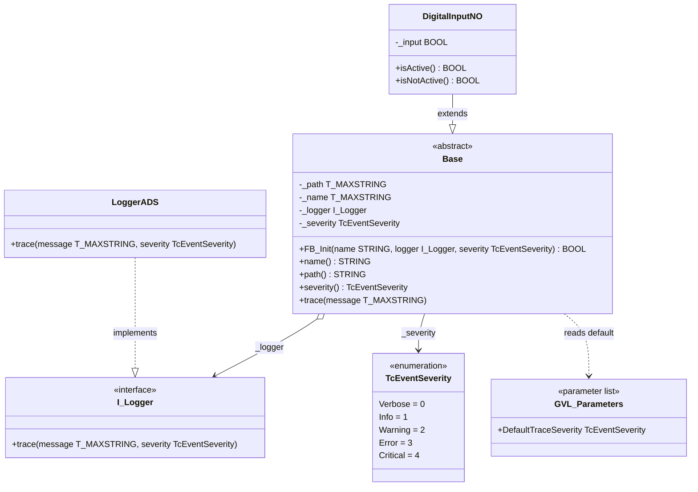

# Exercise 03a — Severity Levels in the Logger

## Introduction

> *"The logger works, but every message comes out at the same level. I want different classes to log at different severities — and I want a sensible default I can tune per deployment without recompiling."*

Exercise 03 established the dependency injection pattern: `Base` calls `_logger.trace(message)` through the `I_Logger` interface. Every trace call currently arrives at `LoggerADS` with the same `ADSLOG_MSGTYPE_HINT` mask regardless of whether the message describes a normal state transition or a hardware fault.

In a real framework this becomes a problem quickly. Verbose diagnostic output from ten sensors floods the event window and buries the messages that actually matter. What is needed is a severity model: each object knows its own log level, attaches that level to every message it emits, and the logger uses it to route or filter.

This exercise describes the full design for that change. **No source files are modified here** — the steps below form a self-contained implementation guide you carry out yourself.

---

## Concepts Introduced

### 1. `TcEventSeverity` — the TwinCAT severity model

Beckhoff's `Tc3_EventLogger` library defines a standard severity enumeration:

| Value | Name | Meaning |
|---|---|---|
| 0 | `Verbose` | Detailed internal state — useful during development, noisy in production |
| 1 | `Info` | Normal operational events — state changes, cycle completions |
| 2 | `Warning` | Something unexpected but recoverable — degraded behaviour, configuration mismatch |
| 3 | `Error` | A failure that affects operation — requires attention |
| 4 | `Critical` | A failure that stops operation — requires immediate action |

Using `TcEventSeverity` rather than your own enum means every logger implementation and every consumer in the framework speaks the same vocabulary as the rest of the TwinCAT ecosystem.

`Tc3_EventLogger` is not yet referenced in `PLC_FrameworkOOP`. Adding it is the first step.

---

### 2. Per-instance severity — each class owns its own log level

The severity level is not a property of the message. It is a property of the object that emits it.

A `DigitalInputNO` on a safety door might always trace at `Warning` because any transition on that input warrants attention. A `DigitalInputNO` counting products on a conveyor might trace at `Verbose` because its transitions are routine. Both objects call the same `trace(message)` method — the severity rides along silently in `_severity`.

`Base` stores a private `_severity : TcEventSeverity`. When `trace` is called, it passes the message AND `_severity` to the injected logger. The logger decides what to do with the combination.

Three ways the severity reaches an instance:

1. **At construction** — passed as an optional parameter to `FB_Init`. If omitted, falls back to the global default.
2. **At runtime** — a read/write `severity` property lets commissioning engineers increase verbosity on a specific object without changing code.
3. **Global default** — if neither of the above is set, `Base._severity` is initialised from `GVL_Parameters.DefaultTraceSeverity`.

---

### 3. Parameter list vs constant list

This design requires a global default severity that different deployments can tune. TwinCAT offers two mechanisms for global values, and choosing the wrong one matters.

#### `VAR_GLOBAL CONSTANT` — a constant list

```iecst
VAR_GLOBAL CONSTANT
    DefaultTraceSeverity : TcEventSeverity := TcEventSeverity.Verbose;
END_VAR
```

The compiler substitutes the value at every point of use, identically to a `#define` in C. The value is baked into the compiled binary at build time. **Changing it requires a full recompile and a code download** — which requires TwinCAT XAE to be present on-site or a new firmware package to be shipped. Every machine running the same binary gets the same value with no way to differentiate.

Constants are the right tool for values that are truly invariant: physical constants, safety-critical hardware limits, protocol magic numbers. They are the wrong tool for deployment configuration.

#### Parameter list — a non-constant GVL

```iecst
// GVL_Parameters — created in TwinCAT XAE as a Parameter List
{attribute 'linkalways'}
VAR_GLOBAL
    DefaultTraceSeverity : TcEventSeverity := TcEventSeverity.Verbose;
END_VAR
```

A parameter list is a GVL whose values live in the boot project as initialised variables rather than as compile-time substitutions. TwinCAT supports boot project parameter files (`.TcBootData`) that can override GVL values on startup **without a code download** — only the parameter file changes, not the binary.

This means:

| Scenario | Constant list | Parameter list |
|---|---|---|
| Development — verbose output | Recompile needed | Edit parameter file |
| Production — suppress noise | Recompile needed | Edit parameter file |
| Machine A: `Warning`, Machine B: `Verbose` | Two separate builds | One binary, two parameter files |
| Commissioning engineer adjusts on-site | Not possible without XAE | Possible with a text editor |

Robert C. Martin's **Single Responsibility Principle** (the S in SOLID) applies here too:

> *"A class should have one, and only one, reason to change."*
> — Robert C. Martin, *Agile Software Development*, 2002

If the default severity were a compile-time constant, `GVL_Parameters` would have two reasons to change: the value itself, and the need to recompile. Separating configuration from code is the same principle applied at the deployment level.

---

### 4. Changes required across the stack

Adding severity touches four places. Each change is isolated — no existing logic breaks.

#### `I_Logger` — add severity to the `trace` contract

The interface must be updated to include `severity` so every logger implementation is required to handle it:

```iecst
METHOD trace
VAR_INPUT
    message  : T_MAXSTRING;
    severity : TcEventSeverity;
END_VAR
```

This is a breaking change to the interface contract. Every class implementing `I_Logger` must update its `trace` method signature. Currently only `LoggerADS` does — so the blast radius is small.

#### `LoggerADS` — map `TcEventSeverity` to `ADSLOG_MSGTYPE_*`

`LoggerADS.trace` maps the incoming severity to the correct ADS log mask:

| `TcEventSeverity` | `ADSLOG_MSGTYPE_*` |
|---|---|
| `Verbose`, `Info` | `ADSLOG_MSGTYPE_HINT` |
| `Warning` | `ADSLOG_MSGTYPE_WARN` |
| `Error`, `Critical` | `ADSLOG_MSGTYPE_ERROR` |

A `CASE` statement on `severity` selects the mask, then calls `ADSLOGSTR` with the result. The mapping lives entirely inside `LoggerADS` — no other class needs to know about `ADSLOG_MSGTYPE_*`.

#### `Base` — store severity, expose it, use it in `trace`

Three additions to `Base`:

1. A private `_severity : TcEventSeverity` in the `VAR` block, initialised from `GVL_Parameters.DefaultTraceSeverity`
2. An optional `severity : TcEventSeverity` parameter at the end of `FB_Init`; if the caller passes it, it overrides the default
3. A read/write `severity` property to allow runtime adjustment
4. Update `Base.trace` to call `_logger.trace(message, _severity)` — and update the `ELSE` fallback to use the appropriate `ADSLOG_MSGTYPE_*` based on `_severity`

#### `GVL_Parameters` — the parameter list

A new item in the `PLC_FrameworkOOP` project, created as a **Parameter List** (not a plain GVL):

```iecst
{attribute 'linkalways'}
VAR_GLOBAL
    DefaultTraceSeverity : TcEventSeverity := TcEventSeverity.Verbose;
END_VAR
```

The `{attribute 'linkalways'}` pragma ensures TwinCAT always includes this GVL in the build even if no code directly references the symbol — which matters if the only reference is via `Base._severity` initialisation.

---

## Architecture



`Base` now has two injected dependencies: the logger (supplied by the caller) and the default severity (read from the parameter list when no explicit value is given). The parameter list is shown as a dashed dependency — `Base` reads from it once during `FB_Init` initialisation, not on every scan.

---

## Step-by-Step Guide

### Step 1 — Add `Tc3_EventLogger` as a library reference

In Solution Explorer, right-click **References** under `PLC_FrameworkOOP` → **Add Library**. Search for `Tc3_EventLogger` and add the Beckhoff-supplied version. This makes `TcEventSeverity` available in the project.

> Without this reference the `TcEventSeverity` type is undefined and none of the steps below will compile.

---

### Step 2 — Create `GVL_Parameters` as a Parameter List

Right-click `PLC_FrameworkOOP` → **Add** → **Parameter List (GVL)**. Name it `GVL_Parameters`.

Add the default severity variable:

```iecst
{attribute 'linkalways'}
VAR_GLOBAL
    DefaultTraceSeverity : TcEventSeverity := TcEventSeverity.Verbose;
END_VAR
```

Set the initial value to whatever is appropriate for your development environment — `Verbose` gives maximum output while building the framework. Deployments tune it by editing the boot project parameter file.

> **Why `{attribute 'linkalways'}`?** TwinCAT's linker strips GVL symbols that have no direct code references. `GVL_Parameters.DefaultTraceSeverity` is only referenced in `Base.FB_Init` during variable initialisation, which the linker may not count as a reference. The pragma guarantees the symbol survives the build.

---

### Step 3 — Update `I_Logger` to carry severity

Open `I_Logger.TcIO`. Add the `severity` input to the `trace` method:

```iecst
METHOD trace
VAR_INPUT
    message  : T_MAXSTRING;
    severity : TcEventSeverity;
END_VAR
```

Save. The project will not compile until `LoggerADS` is updated — that is the compiler enforcing the interface contract. Any future logger you add must also handle severity, by design.

---

### Step 4 — Update `LoggerADS` to map severity to ADS log types

Open `LoggerADS`. Update the `trace` method signature to match the new contract, then implement the mapping:

```iecst
METHOD trace
VAR_INPUT
    message  : T_MAXSTRING;
    severity : TcEventSeverity;
END_VAR
VAR
    mask : DWORD;
END_VAR
```

In the body, select the mask with a `CASE` on `severity`, then call `ADSLOGSTR`:

```iecst
CASE severity OF
    TcEventSeverity.Warning:
        mask := ADSLOG_MSGTYPE_WARN;
    TcEventSeverity.Error,
    TcEventSeverity.Critical:
        mask := ADSLOG_MSGTYPE_ERROR;
ELSE
    mask := ADSLOG_MSGTYPE_HINT;
END_CASE

ADSLOGSTR(msgCtrlMask := mask, msgFmtStr := message, strArg := '');
```

The mapping lives here and nowhere else. If you later add a `LoggerFile`, it makes its own decision about what to do with each severity — `Base` and `I_Logger` are untouched.

---

### Step 5 — Add `_severity` to `Base`

Open `Base`. Add the private severity variable to the `VAR` block and initialise it from the parameter list:

```iecst
_severity : TcEventSeverity := GVL_Parameters.DefaultTraceSeverity;
```

The initialiser runs before `FB_Init` is called. This means if the caller does not supply a severity in `FB_Init`, the object already holds the global default from the first scan.

---

### Step 6 — Update `Base.FB_Init` to accept an optional severity

Add `severity` as the last parameter of `FB_Init`:

```iecst
METHOD FB_Init : BOOL
VAR_INPUT
    bInitRetains : BOOL;
    bInCopyCode  : BOOL;
    name         : STRING;
    logger       : I_Logger;
    severity     : TcEventSeverity;
END_VAR
```

In the body, override `_severity` only when the caller supplied a non-default value:

```iecst
_name   := name;
_logger := logger;

IF severity <> TcEventSeverity.Verbose THEN
    _severity := severity;
END_IF
```

> **A design trade-off:** Using `Verbose` (value 0) as the sentinel for "not supplied" works because `Verbose` is the lowest level — supplying it explicitly means the same as not supplying it at all. If you need to explicitly set `Verbose` on a class that has a higher default, use the `severity` property instead (Step 7).

Alternatively, you can skip the conditional and always assign `_severity := severity`. Then the caller must be explicit: omitting the argument sets severity to `Verbose` (the default ENUM value for an unset parameter), which is valid behaviour since it is the most permissive level.

---

### Step 7 — Add a `severity` read/write property to `Base`

Right-click `Base` → **Add** → **Property**. Name: `severity`, type: `TcEventSeverity`. Implement both GET and SET:

```iecst
// GET
severity := _severity;

// SET
_severity := severity;
```

The SET accessor allows runtime adjustment without reconstructing the object. A commissioning engineer can write to `noInput.severity` in the TwinCAT online view to temporarily raise verbosity on a specific input without touching any other instance.

---

### Step 8 — Update `Base.trace` to pass severity

Open the `trace` method. Pass `_severity` to the logger call, and update the fallback path to use the same severity mapping logic:

```iecst
METHOD trace
VAR_INPUT
    message : T_MAXSTRING;
END_VAR
VAR
    mask : DWORD;
END_VAR
IF __ISVALIDREF(_logger) THEN
    _logger.trace(message, _severity);
ELSE
    CASE _severity OF
        TcEventSeverity.Warning:
            mask := ADSLOG_MSGTYPE_WARN;
        TcEventSeverity.Error,
        TcEventSeverity.Critical:
            mask := ADSLOG_MSGTYPE_ERROR;
    ELSE
        mask := ADSLOG_MSGTYPE_HINT;
    END_CASE
    ADSLOGSTR(msgCtrlMask := mask, msgFmtStr := message, strArg := '');
END_IF
```

The fallback path now respects the severity setting even without an injected logger. An object without a logger still routes errors to the ADS error channel.

> **Note:** The `CASE` statement in the fallback duplicates the mapping logic from `LoggerADS`. This is a known trade-off in the null-fallback design. If the duplication bothers you, the fallback can instantiate a local `LoggerADS` instance internally and call it — but that re-introduces a concrete dependency in `Base`. Duplication of four lines is the lesser cost.

---

### Step 9 — Update `DevicesExample` to demonstrate severity

Open `DevicesExample`. Pass an explicit severity for one instance to show the difference:

```iecst
VAR
    logger     : LoggerADS;

    noInput    : DigitalInputNO('I201.1',        logger, TcEventSeverity.Warning);
    ncInput    : DigitalInputNC('I201.2',        logger, TcEventSeverity.Info);
    dummyInput : DigitalInputDummy('Undefined IO', logger);
END_VAR
```

`dummyInput` receives no severity — it inherits `GVL_Parameters.DefaultTraceSeverity`. `noInput` is explicitly set to `Warning`. When `traceAll` fires, all three messages arrive at `LoggerADS.trace` with different severity values, and the ADS event window displays them with different icons.

---

## What to Observe After Implementation

1. Force `traceAll` — inspect the TwinCAT event window. `noInput`'s message appears with the warning icon, `ncInput`'s with the hint icon
2. In online view, write `TcEventSeverity.Error` to `noInput.severity` — the next `traceAll` trigger produces an error-level event from `noInput` without restarting or recompiling
3. Change `GVL_Parameters.DefaultTraceSeverity` to `TcEventSeverity.Warning` in the parameter file and restart — `dummyInput` now traces at warning level without any code change

---

## Design Decisions Left Open

Two questions deliberately remain unanswered here so you can form a view before the next exercise:

**1. Should severity be a filter threshold or a message tag?**
This exercise treats severity as a tag: every `trace` call carries the instance's configured severity, and the logger decides what to do with it. An alternative is a threshold model: `trace` only calls the logger at all if `_severity <= someThreshold`. The tag model is more flexible (loggers can route by severity differently); the threshold model gives objects more control over their own verbosity. Which fits the framework better depends on how the logger layer evolves.

**2. Should `I_Logger.trace` carry the severity, or should there be separate methods?**
The current proposal adds `severity` as a parameter. An alternative is separate methods: `traceInfo`, `traceWarning`, `traceError`. Separate methods make call sites self-documenting (`noInput.traceWarning(...)`) but bloat `I_Logger` and every implementation. The parameter approach keeps the interface minimal. This is a direct application of the **Interface Segregation Principle** (the I in SOLID) — consider which side of that trade-off serves the framework's consumers.
