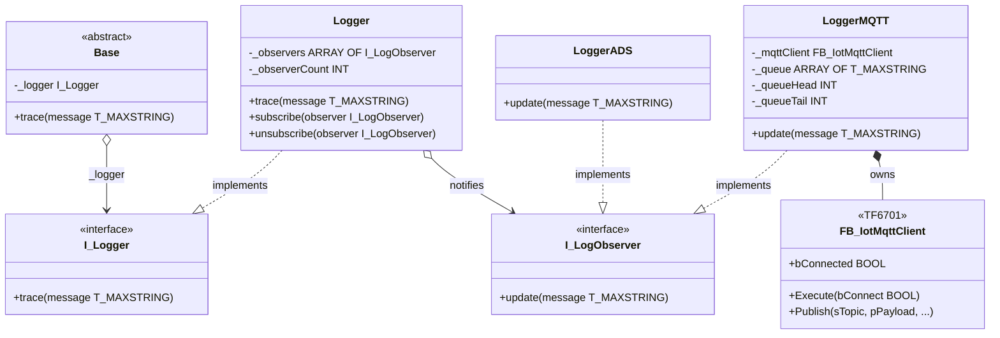

# Exercise 03b — The Observer Pattern and Multi-Destination Logging

## Introduction

> *"We nicely decoupled the logger from Base with dependency injection — but now a customer wants trace messages forwarded to an MQTT broker as well. The problem is we are stuck to LoggerADS."*

Exercise 03 solved one problem cleanly: `Base` no longer decides where log messages go. That decision was moved to the caller via dependency injection. But the design still assumes there is exactly **one** destination. When a second destination is required, the only options under the current design are:

1. Write a new `LoggerADSAndMQTT` that hard-codes both destinations — a new class for every combination, forever
2. Inject two separate loggers into `Base.FB_Init` — breaks the single-parameter contract and still has a fixed ceiling
3. Let `Base` loop over a list of loggers — `Base` is now managing a subscriber list, which is not its job

None of these scales. The problem is not with dependency injection — that was the right choice. The problem is that the logger itself has no way to fan a single incoming message out to multiple destinations.

This is a solved problem. The Gang of Four named it the **Observer** pattern in 1994, and it fits here precisely.

This exercise describes the full redesign. **No source files are modified here** — the steps below form the implementation guide you carry out yourself.

---

## Concepts Introduced

### 1. Why a second logger breaks the current design

In Exercise 03, `DevicesExample` declares:

```iecst
logger    : LoggerADS;
noInput   : DigitalInputNO('I201.1', logger);
```

`logger` is an `I_Logger`. `Base` calls `_logger.trace(message)`. One call, one destination. If we want ADS *and* MQTT, there is no clean place to put the fan-out logic under the current structure — unless the logger itself becomes responsible for forwarding.

That is exactly what the Observer pattern does: it makes the logger a **publisher** that holds a list of **subscribers**, and notifies all of them on every message.

---

### 2. The Observer pattern

The Gang of Four define the Observer pattern as:

> *"Define a one-to-many dependency between objects so that when one object changes state, all its dependents are notified and updated automatically."*
> — Gamma, Helm, Johnson, Vlissides, *Design Patterns*, 1994

Also known as **Publish-Subscribe**, the pattern has four participants:

| GoF participant | Role | This framework |
|---|---|---|
| **Subject** | Knows its observers; provides attach/detach interface; notifies on change | `Logger` |
| **Observer** | Defines the update interface for objects that must be notified | `I_LogObserver` |
| **ConcreteSubject** | Stores state; sends notification to observers when state changes | `Logger` (Subject and ConcreteSubject are merged here) |
| **ConcreteObserver** | Maintains consistency with Subject's state via the update interface | `LoggerADS`, `LoggerMQTT` |

The canonical Observer UML has `Subject` knowing only `I_Observer`, never the concrete observers. This is the key structural rule: the Subject is open to any number of observers without knowing what any of them do. Adding `LoggerMQTT` requires zero changes to `Logger`, zero changes to `LoggerADS`, and zero changes to `Base`.

Robert C. Martin states this as the **Open/Closed Principle** (O in SOLID):

> *"A software artifact should be open for extension but closed for modification."*
> — Robert C. Martin, *Clean Architecture*, 2017

Each new log destination is an extension. Nothing existing is modified.

---

### 3. Mapping the pattern to the logger stack

The new responsibility split:

| Class | Was | Now |
|---|---|---|
| `I_Logger` | Contract for anything `Base` calls | Unchanged — `Logger` implements it |
| `Logger` | Did not exist | Subject: implements `I_Logger`, holds subscriber list, calls `update` on all subscribers |
| `I_LogObserver` | Did not exist | Observer contract: single `update(message)` method |
| `LoggerADS` | Implemented `I_Logger`, called `ADSLOGSTR` | Now implements `I_LogObserver`; `update` calls `ADSLOGSTR` |
| `LoggerMQTT` | Did not exist | ConcreteObserver: implements `I_LogObserver`; `update` queues message for MQTT publish |

`Base` is completely unchanged. It still holds `I_Logger` and calls `_logger.trace(message)`. From `Base`'s perspective nothing has happened — the injected logger just happens to be the new `Logger` subject instead of `LoggerADS` directly.

---

### 4. Fixed-size subscriber lists in TwinCAT

TwinCAT does not support dynamic arrays. The subscriber list in `Logger` is a fixed-size array of `I_LogObserver` references with a compile-time upper bound:

```iecst
VAR
    _observers     : ARRAY[0..MAX_LOG_OBSERVERS - 1] OF I_LogObserver;
    _observerCount : INT;
END_VAR
```

Define `MAX_LOG_OBSERVERS` as a constant (in a `GVL` or inline) — a value of 8 is sufficient for most use cases. The `subscribe` method fills the next empty slot; `unsubscribe` removes a reference and compacts the array. Validity of each slot is checked with `__ISVALIDREF(_observers[i])` before calling `update`.

---

### 5. Cyclic processing — a TwinCAT-specific consideration

The Observer `update` method is called synchronously inside the PLC scan cycle: `Logger.trace` loops over subscribers and calls `update` on each one immediately. For `LoggerADS` this is fine — `ADSLOGSTR` is a fire-and-forget system call.

For `LoggerMQTT` it is not that simple. The TF6701 MQTT client function block `FB_IotMqttClient` is a **state-machine-driven** FB that must be called every PLC scan to advance its connection handling and drain its internal transmit queue. A pure class with `{attribute 'no_explicit_call'}` cannot satisfy this requirement because it has no cyclic body.

The design resolution: **`LoggerMQTT` is an infrastructure service, not a domain class.**

- Remove the `{attribute 'no_explicit_call'}` pragma from `LoggerMQTT`
- Declare `LoggerMQTT` in `MAIN` and call it explicitly every scan
- `LoggerMQTT.update(message)` enqueues the message into an internal ring buffer
- The cyclic body of `LoggerMQTT` calls `_mqttClient(...)` and drains the queue by publishing one message per scan

This separates the **notification** concern (synchronous, via Observer `update`) from the **transmission** concern (asynchronous, via the MQTT state machine). The Observer pattern remains intact; only the implementation detail of how `LoggerMQTT` processes messages is asynchronous.

> The distinction between synchronous notification and asynchronous delivery is fundamental. The Observer pattern only guarantees notification; what the observer does with the notification is its own concern. `LoggerMQTT` is a perfectly valid observer that happens to defer actual delivery.

---

### 6. TF6701 — TwinCAT IoT Communication Library

Beckhoff's **TF6701** is the TwinCAT 3 IoT Communication library. It provides `FB_IotMqttClient` from the `Tc3_IotBase` namespace, which implements a full MQTT 3.1.1 client.

Key properties and methods used in this exercise:

| Member | Type | Purpose |
|---|---|---|
| `sHostName` | `STRING` | Broker hostname |
| `nHostPort` | `UINT` | Broker port (1883 plain, 8883 TLS) |
| `sClientId` | `STRING` | Unique client identifier per machine |
| `bTls` | `BOOL` | Enable TLS encryption |
| `Execute(bConnect)` | Method | Must be called every scan; drives the state machine |
| `bConnected` | `BOOL` | TRUE when the client is connected to the broker |
| `Publish(sTopic, pPayload, nPayloadSize, eQoS, bRetain, bQueue)` | Method | Enqueues a message for transmission |

`Publish` is non-blocking. It places the message in the client's internal transmit buffer and returns immediately. The actual transmission happens over subsequent scan cycles as `Execute` is called.

---

## Architecture



The central structural rule of the Observer pattern is visible in the diagram: `Logger` points only to `I_LogObserver`. It has no arrow to `LoggerADS` or `LoggerMQTT`. New observers can be added without the diagram changing on the Subject side.

---

## Step-by-Step Guide

### Prerequisites

- Exercise 03 completed — `Base`, `I_Logger`, `LoggerADS`, and `DevicesExample` with DI in place
- TF6701 licensed and installed on the TwinCAT development machine
- [TwinCAT coding style](TwinCAT-coding-style.md) at hand

---

### Step 1 — Add the `Tc3_IotBase` library reference

Right-click **References** under `PLC_FrameworkOOP` → **Add Library**. Search for `Tc3_IotBase` (part of TF6701). Add the Beckhoff-supplied version.

`FB_IotMqttClient` and related types are now available in the project.

---

### Step 2 — Create the `I_LogObserver` interface

Right-click the `Logger` folder → **Add** → **Interface**. Name: `I_LogObserver`.

Add a single method:

```iecst
METHOD update
VAR_INPUT
    message : T_MAXSTRING;
END_VAR
```

This is the Observer contract — the only thing the Subject (`Logger`) ever calls on its subscribers. Every concrete logger must implement exactly this.

> **Why `update` and not `trace`?** The method name `trace` belongs to `I_Logger` — the interface `Base` programs against. `update` is the notification verb from GoF. Keeping the names distinct makes the two roles — entry point for callers, and notification target for subscribers — visually explicit in code.

---

### Step 3 — Create the `Logger` Subject

Right-click the `Logger` folder → **Add** → **Function Block**. Name: `Logger`. Add the `IMPLEMENTS I_Logger` clause.

**Declaration:**

```iecst
FUNCTION_BLOCK Logger IMPLEMENTS I_Logger
VAR CONSTANT
    MAX_OBSERVERS : INT := 8;
END_VAR
VAR
    _observers     : ARRAY[0..MAX_OBSERVERS - 1] OF I_LogObserver;
    _observerCount : INT;
END_VAR
```

Leave the cyclic body empty — `Logger` has no scan-cycle logic of its own.

**Add the `trace` method** (implements `I_Logger`):

```iecst
METHOD trace
VAR_INPUT
    message : T_MAXSTRING;
END_VAR
VAR
    i : INT;
END_VAR
FOR i := 0 TO _observerCount - 1 DO
    IF __ISVALIDREF(_observers[i]) THEN
        _observers[i].update(message);
    END_IF
END_FOR
```

**Add the `subscribe` method:**

```iecst
METHOD subscribe
VAR_INPUT
    observer : I_LogObserver;
END_VAR
IF _observerCount < MAX_OBSERVERS THEN
    _observers[_observerCount] := observer;
    _observerCount := _observerCount + 1;
END_IF
```

**Add the `unsubscribe` method:**

```iecst
METHOD unsubscribe
VAR_INPUT
    observer : I_LogObserver;
END_VAR
VAR
    i    : INT;
    j    : INT;
    found : BOOL;
END_VAR
FOR i := 0 TO _observerCount - 1 DO
    IF _observers[i] = observer THEN
        found := TRUE;
    END_IF
    IF found AND i < _observerCount - 1 THEN
        _observers[i] := _observers[i + 1];
    END_IF
END_FOR
IF found THEN
    _observerCount := _observerCount - 1;
END_IF
```

`unsubscribe` compacts the array by shifting remaining entries down so no gaps form in the middle. This keeps the `FOR` loop in `trace` simple.

---

### Step 4 — Refactor `LoggerADS` to implement `I_LogObserver`

Open `LoggerADS`. Change the declaration line:

```iecst
FUNCTION_BLOCK LoggerADS IMPLEMENTS I_LogObserver
```

Rename the existing `trace` method to `update` and update its signature to match `I_LogObserver`:

```iecst
METHOD update
VAR_INPUT
    message : T_MAXSTRING;
END_VAR
```

The body remains unchanged — it still calls `ADSLOGSTR`.

> **Breaking change:** `LoggerADS` no longer implements `I_Logger`. Any code that injects `LoggerADS` directly into `Base.FB_Init` will fail to compile. Step 7 fixes `DevicesExample`. This is intentional — the compiler enforces the architectural change rather than silently allowing mixed usage.

---

### Step 5 — Create `LoggerMQTT`

Right-click the `Logger` folder → **Add** → **Function Block**. Name: `LoggerMQTT`. Add `IMPLEMENTS I_LogObserver`. Do **not** add `{attribute 'no_explicit_call'}` — this FB must be called cyclically.

**Declaration:**

```iecst
FUNCTION_BLOCK LoggerMQTT IMPLEMENTS I_LogObserver
VAR CONSTANT
    QUEUE_SIZE : INT := 32;
END_VAR
VAR
    _mqttClient  : FB_IotMqttClient;
    _topic       : STRING;
    _queue       : ARRAY[0..QUEUE_SIZE - 1] OF T_MAXSTRING;
    _queueHead   : INT;
    _queueTail   : INT;
    _queueCount  : INT;
END_VAR
```

**Add the `FB_Init` constructor** to receive broker configuration at instantiation:

```iecst
METHOD FB_Init : BOOL
VAR_INPUT
    bInitRetains : BOOL;
    bInCopyCode  : BOOL;
    sHost        : STRING;
    nPort        : UINT;
    sClientId    : STRING;
    sTopic       : STRING;
END_VAR
_mqttClient.sHostName := sHost;
_mqttClient.nHostPort := nPort;
_mqttClient.sClientId := sClientId;
_topic := sTopic;
```

**Add the `update` method** (implements `I_LogObserver`). Enqueues only — does not block:

```iecst
METHOD update
VAR_INPUT
    message : T_MAXSTRING;
END_VAR
IF _queueCount < QUEUE_SIZE THEN
    _queue[_queueTail] := message;
    _queueTail := (_queueTail + 1) MOD QUEUE_SIZE;
    _queueCount := _queueCount + 1;
END_IF
```

**Cyclic body** — drives the MQTT state machine and drains one queued message per scan:

```iecst
_mqttClient.Execute(bConnect := TRUE);

IF _mqttClient.bConnected AND _queueCount > 0 THEN
    _mqttClient.Publish(
        sTopic        := _topic,
        pPayload      := ADR(_queue[_queueHead]),
        nPayloadSize  := LEN(_queue[_queueHead]),
        eQoS          := eQoS_ExactlyOnce,
        bRetain       := FALSE,
        bQueue        := TRUE
    );
    _queueHead  := (_queueHead + 1) MOD QUEUE_SIZE;
    _queueCount := _queueCount - 1;
END_IF
```

The ring buffer absorbs bursts of messages when the MQTT connection is slow or temporarily unavailable. Messages beyond `QUEUE_SIZE` are silently dropped — if that is unacceptable, add an overflow counter and trace it via the ADS logger.

---

### Step 6 — Configure the MQTT connection to HiveMQ

The HiveMQ public broker accepts anonymous connections on port 1883 with no credentials required. It is a shared public broker — suitable for development and training, not for production.

**Broker parameters:**

| Parameter | Value |
|---|---|
| `sHost` | `'broker.hivemq.com'` |
| `nPort` | `1883` |
| `sClientId` | A unique string per machine — see below |
| `sTopic` | `'plc-oop-framework/{uuid}/trace'` — see below |

**Client ID:** Every MQTT client connected to a broker must have a unique `clientId`. Two clients with the same ID will knock each other off the broker. Generate a random 8-character hex string for each machine and embed it at instantiation:

```iecst
loggerMqtt : LoggerMQTT('broker.hivemq.com', 1883, 'plc-oop-a3f7c291', 'plc-oop-framework/a3f7c291/trace');
```

**Topic anonymization:** The topic path must not contain customer names, machine serial numbers, site locations, or any identifier that links the message to a real deployment on a shared public broker. A random UUID-segment in the path (`a3f7c291`) is sufficient for training purposes. For production deployments use a private broker with authentication, or at minimum a TLS-encrypted connection on port 8883.

> Anything published to `broker.hivemq.com` is visible to anyone who subscribes to the same topic. Do not publish process values, alarm states, or any data that could identify a machine or customer.

---

### Step 7 — Assemble the logger stack in `DevicesExample` and `MAIN`

**`DevicesExample`** — replace `LoggerADS` with the new `Logger` Subject, subscribe both concrete loggers:

```iecst
PROGRAM DevicesExample
VAR
    logger      : Logger;
    loggerAds   : LoggerADS;
    loggerMqtt  : LoggerMQTT('broker.hivemq.com', 1883, 'plc-oop-a3f7c291', 'plc-oop-framework/a3f7c291/trace');

    noInput     : DigitalInputNO('I201.1', logger);
    ncInput     : DigitalInputNC('I201.2', logger);
    dummyInput  : DigitalInputDummy('Undefined IO', logger);
    ...
END_VAR
```

The body must subscribe the concrete loggers before the inputs produce any trace output. Do this in the first scan using an initialisation flag:

```iecst
VAR
    _initialised : BOOL;
END_VAR

IF NOT _initialised THEN
    logger.subscribe(loggerAds);
    logger.subscribe(loggerMqtt);
    _initialised := TRUE;
END_IF
```

**`MAIN`** — call `loggerMqtt` cyclically so the MQTT state machine runs every scan:

```iecst
PROGRAM MAIN
DevicesExample();
DevicesExample.loggerMqtt();
```

> `MAIN` reaches into `DevicesExample.loggerMqtt` directly because `loggerMqtt` is a public PROGRAM variable. If that coupling bothers you, move `loggerMqtt` up to `MAIN` and pass it down via `subscribe` after the `DevicesExample` program block runs. Either works — the Observer pattern remains unchanged.

---

## What to Observe After Implementation

1. Force `traceAll` — the TwinCAT XAE event window receives the three messages as before
2. Open an MQTT client (e.g. MQTT Explorer, or the HiveMQ WebSocket client at `ws://broker.hivemq.com:8000/mqtt`) and subscribe to `plc-oop-framework/{your-uuid}/trace` — the same messages appear there within one or two seconds
3. Force `traceAll` again with `loggerAds` unsubscribed (call `logger.unsubscribe(loggerAds)` via forced write) — the ADS event window goes silent; the MQTT stream continues uninterrupted
4. Temporarily stop the network adapter — `loggerMqtt._queueCount` climbs as messages accumulate; when the network returns, the queue drains over subsequent scans

Point 3 shows the Observer pattern's primary property: the Subject is unaffected by changes to the subscriber list. Point 4 shows the ring buffer absorbing transient delivery failures without losing trace calls.

---

## Design Trade-offs and Open Questions

**1. Subscribe order**
Observers are notified in subscription order. If `LoggerMQTT.update` were slow (it is not, because it only enqueues), it would delay `LoggerADS`. The current design calls `update` synchronously and sequentially. A parallel notification model is not practical in a single-threaded PLC scan.

**2. Queue overflow policy**
The ring buffer silently drops messages on overflow. Alternatives: block the caller (unacceptable in a scan cycle), return an error code from `update` (changes `I_LogObserver` contract), or raise an alarm via a separate channel. The right choice depends on whether dropped log messages are operationally significant.

**3. `Logger` itself has no fallback**
Unlike `Base.trace`, which falls back to `ADSLOGSTR` when no logger is injected, `Logger.trace` with an empty subscriber list silently discards messages. Consider whether `Logger` should auto-subscribe a `LoggerADS` instance if the subscriber list is empty at the time of the first `trace` call.

**4. Thread safety**
TwinCAT's default single-task model makes this a non-issue here. If `Logger` is ever shared across tasks running at different priorities, `subscribe` and `unsubscribe` must be protected — or constrained to startup only.
