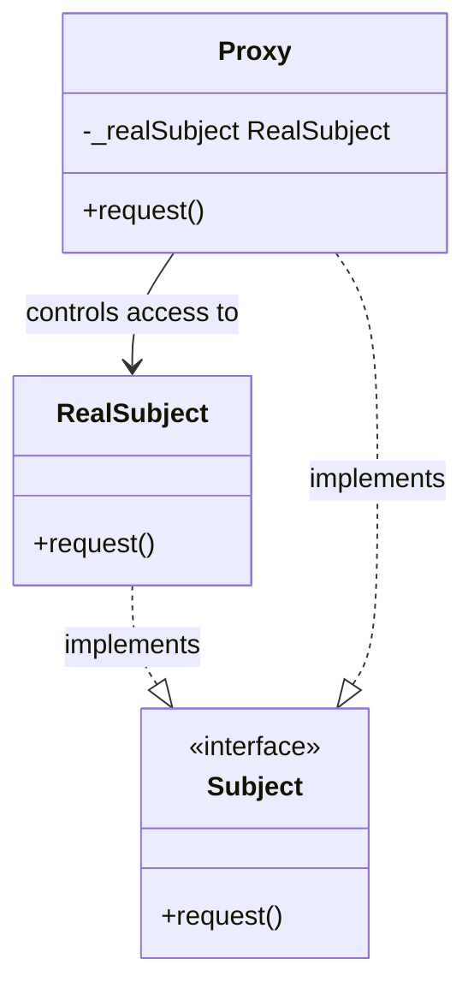
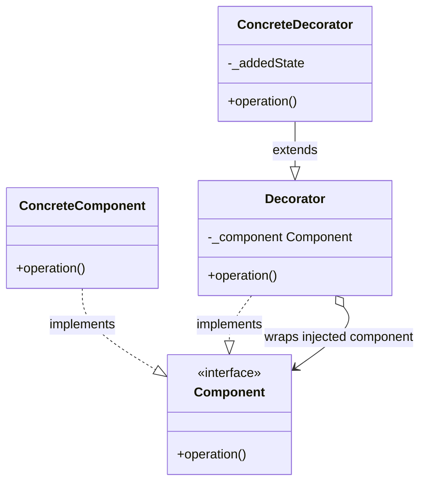
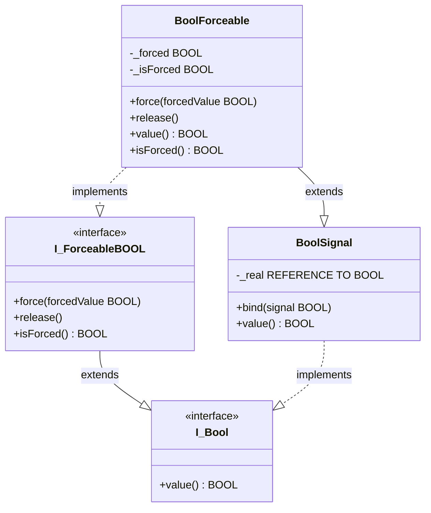
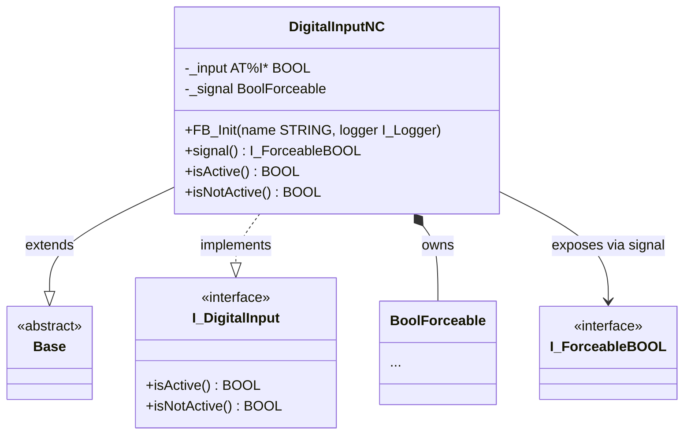

# Exercise 04 — Proxy and Decorator: the Forceable Signal

## Introduction

> *"We want to be able to override hardware signal values during commissioning and testing — without duplicating that logic in every device class."*

Every machine goes through a commissioning phase where the hardware is not yet wired, not yet present, or needs to be held at a known state to test downstream logic. Reaching into `DigitalInputNC` and adding an `_isForced` flag there is the obvious first move — and the wrong one. The next device class (`DigitalInputNO`, `DigitalInputDummy`, a future pressure sensor) would need the same flag, the same `force` method, the same release logic. The logic is not about what a digital input *is* — it is about what a *boolean signal* can be asked to do.

This exercise introduces two structural patterns from the Gang of Four that both address this problem, explains why they are different, and shows which one is the right tool here.

By the end of this exercise you will have:

- `I_Bool` and `I_ForceableBOOL` — a two-level read/force interface hierarchy
- `BoolSignal` — the Real Subject: wraps a hardware-mapped `BOOL` by reference
- `BoolForceable` — the Proxy: extends `BoolSignal` and intercepts `value` reads
- `DigitalInputNC` using `BoolForceable` internally, exposing `I_ForceableBOOL` via a `signal` property
- `ForceableExample` demonstrating the full forcing cycle in online view

---

## Concepts Introduced

### 1. The Proxy pattern

The Gang of Four define the Proxy pattern as:

> *"Provide a surrogate or placeholder for another object to control access to it."*
> — Gamma, Helm, Johnson, Vlissides, *Design Patterns*, 1994

The Proxy stands between the caller and the real object. The caller does not know it is talking to a proxy — both the proxy and the real object implement the same interface. The proxy decides whether to forward the call, block it, cache the result, or substitute a different value.



Key structural rule: the **RealSubject is an implementation detail of the Proxy**. The caller never holds a `RealSubject` reference directly. The Proxy controls all access.

---

### 2. The Decorator pattern

The Gang of Four define the Decorator pattern as:

> *"Attach additional responsibilities to an object dynamically. Decorators provide a flexible alternative to subclassing for extending functionality."*
> — Gamma, Helm, Johnson, Vlissides, *Design Patterns*, 1994

The Decorator wraps a *component* that is **injected from outside** and adds behaviour around it. Like the Proxy, it implements the same interface as what it wraps — so the caller cannot distinguish a decorated component from a plain one.



Key structural rule: the **wrapped component is injected**. The Decorator does not create or own it — that is the caller's responsibility.

---

### 3. Proxy vs Decorator — the decisive difference

Both patterns make a wrapper that looks like the thing it wraps. The structural difference is one sentence:

| | Proxy | Decorator |
|---|---|---|
| Wrapped object | Created/owned internally | Injected by the caller |
| Purpose | Control or intercept access | Add responsibilities dynamically |
| Relationship to subject | Proxy IS a Subject; real subject is hidden | Decorator IS a Component; wrapped component is known to caller |
| Typical use | Security guard, cache, null object, virtual proxy | Logging wrapper, formatting layer, optional feature |

In our case: `BoolSignal` (the real hardware reader) is created **inside** `DigitalInputNC`, not passed in from outside. `BoolForceable` wraps it via inheritance. The device class hides both from the outside world. That is a Proxy.

A Decorator would be a `ForceableDigitalInput IMPLEMENTS I_DigitalInput` that takes any `I_DigitalInput` at construction and adds force behaviour around `isActive` and `isNotActive`. That operates at a higher level — forcing the *semantic result* rather than the *raw signal* — and is shown as the alternative in exercise 04a.

---

### 4. Our implementation — inheritance-based Proxy

Rather than the classic composition Proxy (where Proxy holds `_realSubject`), we use an **inheritance-based Proxy**: `BoolForceable EXTENDS BoolSignal`. The `_real` reference lives in `BoolSignal`; `BoolForceable` inherits it and overrides `value`. When `_isForced` is false, `SUPER^.value` returns the real hardware signal transparently.

The effect is identical: the caller holds `I_Bool` or `I_ForceableBOOL` and never sees `BoolSignal`. The real subject is fully encapsulated inside the proxy.

---

## Architecture

### Signal layer



`BoolForceable` both *extends* `BoolSignal` (gets the reference binding and transparent read-through for free) and *implements* `I_ForceableBOOL` (satisfies the force/release contract). The compiler verifies both at build time.

### Device layer — `DigitalInputNC` with the proxy



`DigitalInputNC` owns `BoolForceable` by composition. It exposes the forcing interface via a `signal` property typed as `I_ForceableBOOL` — not as the concrete `BoolForceable`. A commissioning tool holds `I_ForceableBOOL` references; it never needs to know which device class it is forcing.

---

## Step-by-Step Guide

### Prerequisites
- Exercise 03 completed — `Base`, `I_Logger`, and the full logger stack in place
- [TwinCAT coding style](TwinCAT-coding-style.md) at hand

---

### Step 1 — Create the `Forceable` folder
Right-click `PLC_FrameworkOOP` → **Add** → **Folder**. Name: `Forceable`.

---

### Step 2 — Create `I_Bool`
Right-click `Forceable` → **Add** → **Interface**. Name: `I_Bool`.

Add one read-only property:

```iecst
INTERFACE I_Bool

PROPERTY value : BOOL
```

This is the minimal read contract for any boolean signal — hardware-mapped, simulated, or forced.

---

### Step 3 — Create `I_ForceableBOOL`
Right-click `Forceable` → **Add** → **Interface**. Name: `I_ForceableBOOL`.

Declare the interface as extending `I_Bool`, then add three members:

```iecst
INTERFACE I_ForceableBOOL EXTENDS I_Bool

METHOD force
VAR_INPUT
    forcedValue : BOOL;
END_VAR

METHOD release

PROPERTY isForced : BOOL
```

`I_ForceableBOOL EXTENDS I_Bool` means any class implementing `I_ForceableBOOL` also satisfies `I_Bool`. A consumer that only needs to read the value receives `I_Bool`; a commissioning tool that needs to force it receives `I_ForceableBOOL`. Both can point to the same instance.

---

### Step 4 — Create `BoolSignal` (the Real Subject)
Right-click `Forceable` → **Add** → **Function Block**. Name: `BoolSignal`. Add `IMPLEMENTS I_Bool`. Add both class pragmas.

**Declaration:**

```iecst
{attribute 'no_explicit_call' := 'BoolSignal is a class, do not call this POU directly, use a method'}
{attribute 'hide_all_locals'}
FUNCTION_BLOCK BoolSignal IMPLEMENTS I_Bool
VAR
    _real : REFERENCE TO BOOL;
END_VAR
```

**`bind` method** — wires the reference to the hardware variable. `VAR_IN_OUT` passes the original variable by reference; `REF=` stores that reference for all future reads:

```iecst
METHOD bind
VAR_IN_OUT
    signal : BOOL;
END_VAR
_real REF= signal;
```

**`value` property:**

```iecst
IF __ISVALIDREF(_real) THEN
    value := _real;
END_IF
```

The `__ISVALIDREF` guard returns `FALSE` if `bind` was never called — the property silently returns `FALSE` rather than crashing with a null-reference exception.

---

### Step 5 — Create `BoolForceable` (the Proxy)
Right-click `Forceable` → **Add** → **Function Block**. Name: `BoolForceable`. Declaration line: `EXTENDS BoolSignal IMPLEMENTS I_ForceableBOOL`. Add both class pragmas.

**Declaration:**

```iecst
{attribute 'no_explicit_call' := 'BoolForceable is a class, do not call this POU directly, use a method'}
{attribute 'hide_all_locals'}
FUNCTION_BLOCK BoolForceable EXTENDS BoolSignal IMPLEMENTS I_ForceableBOOL
VAR
    _forced   : BOOL;
    _isForced : BOOL;
END_VAR
```

**`force` method:**

```iecst
METHOD force
VAR_INPUT
    forcedValue : BOOL;
END_VAR
_forced   := forcedValue;
_isForced := TRUE;
```

**`release` method:**

```iecst
_isForced := FALSE;
```

**`value` property** — the interception point. This overrides `BoolSignal.value`:

```iecst
IF _isForced THEN
    value := _forced;
ELSE
    value := SUPER^.value;
END_IF
```

When `_isForced` is `FALSE`, `SUPER^.value` reads from `BoolSignal.value` which reads `_real` — the real hardware input. The proxy is completely transparent.

**`isForced` property:**

```iecst
isForced := _isForced;
```

---

### Step 6 — Update `DigitalInputNC`

Change the member variable from the old direct `_input` to the proxy. Pass the device name (with a ` forceable` suffix) and the global logger directly in the declaration using TwinCAT's inline `FB_Init` syntax:

```iecst
FUNCTION_BLOCK DigitalInputNC EXTENDS base IMPLEMENTS I_DigitalInput
VAR
    _input  AT %I* : BOOL;
    _signal : BoolForceable(CONCAT(name, ' forceable'), GVL_Logger.Logger);
END_VAR
```

The inline `FB_Init` arguments are evaluated when TwinCAT initialises member FBs — before the containing FB's own `FB_Init` body runs. This gives `_signal` a meaningful name and the global logger as a safe default from the moment it exists.

Add `FB_Init` to refine the signal with the final device name and the injected logger, then bind the hardware reference:

```iecst
METHOD FB_Init : BOOL
VAR_INPUT
    bInitRetains : BOOL;
    bInCopyCode  : BOOL;
    name         : STRING;
    logger       : I_Logger;
END_VAR
_signal.FB_Init(bInitRetains, bInCopyCode, name, logger);
_signal.bind(_input);
```

`_signal.FB_Init(...)` is called a second time here with just `name` (without the ` forceable` suffix) and the caller-supplied `logger`. This allows the device programmer to inject a specific logger via DI while `GVL_Logger.Logger` remains the fallback if none is passed.

Add the `signal` property to expose the forcing interface without leaking the concrete type:

```iecst
PROPERTY signal : I_ForceableBOOL
// GET:
signal := _signal;
```

Update both properties to read through the proxy:

```iecst
// isActive getter
isActive := NOT _signal.value;

// isNotActive getter
isNotActive := _signal.value;
```

The NC inversion (`NOT`) stays exactly where it has always been. Nothing about the NC/NO distinction moves.

---

### Step 7 — Create `ForceableExample`

Create a program in the `Forceable` folder to demonstrate the full forcing cycle. Declare the input with a logger and observe both the semantic properties and the raw proxy state:

```iecst
PROGRAM ForceableExample
VAR
    input           : DigitalInputNC('Door sensor', GVL_Logger.logger);

    isActive        : BOOL;
    isNotActive     : BOOL;
    isForced        : BOOL;
    rawSignalValue  : BOOL;

    forceActive     : BOOL;
    forceInactive   : BOOL;
    releaseForce    : BOOL;

    forceActiveTrig   : R_TRIG;
    forceInactiveTrig : R_TRIG;
    releaseTrig       : R_TRIG;
END_VAR
```

Body:

```iecst
isActive       := input.isActive;
isNotActive    := input.isNotActive;
isForced       := input.signal.isForced;
rawSignalValue := input.signal.value;

forceActiveTrig(CLK := forceActive);
IF forceActiveTrig.Q THEN
    input.signal.force(FALSE);  // NC: raw FALSE → isActive = NOT FALSE = TRUE
END_IF

forceInactiveTrig(CLK := forceInactive);
IF forceInactiveTrig.Q THEN
    input.signal.force(TRUE);   // NC: raw TRUE → isActive = NOT TRUE = FALSE
END_IF

releaseTrig(CLK := releaseForce);
IF releaseTrig.Q THEN
    input.signal.release();
END_IF
```

Call `ForceableExample()` from `MAIN`.

> **NC polarity note:** forcing always operates on the raw signal value, not the semantic meaning. On NC wiring, the raw signal is inverted from the application-level state. To force `isActive = TRUE` you force the raw signal to `FALSE`. This is a natural consequence of the Proxy operating at the signal level. If forcing at the semantic level is preferred, the Decorator approach at the `I_DigitalInput` level is more appropriate.

---

## What to Observe in Online View

1. Toggle hardware — `isActive` and `isNotActive` follow the real `_input` with NC inversion; `isForced` stays `FALSE`
2. Set `forceActive` to `TRUE` — `isForced` becomes `TRUE`; `rawSignalValue` shows `FALSE`; `isActive` becomes `TRUE` regardless of hardware
3. Toggle hardware while forced — `isActive` does not move; `rawSignalValue` still shows the forced value
4. Set `releaseForce` to `TRUE` — `isForced` returns to `FALSE`; `isActive` immediately follows hardware again

---

## Why is `BoolSignal` a Separate Class?

`BoolSignal` was introduced to make the Proxy pattern structurally explicit in this exercise. The two participants of the pattern — Real Subject and Proxy — are visibly separate classes. The inheritance chain `BoolForceable → BoolSignal → I_Bool` maps directly to the GoF diagram.

In practice, `BoolSignal` is never used standalone in this framework. Every hardware-mapped BOOL will always be a `BoolForceable`. `BoolSignal` exists only to be extended, which means it is an intermediate abstraction without an independent use case.

**Exercise 04a removes it.** That version is the one you should ship. This version is the one you should understand first.
