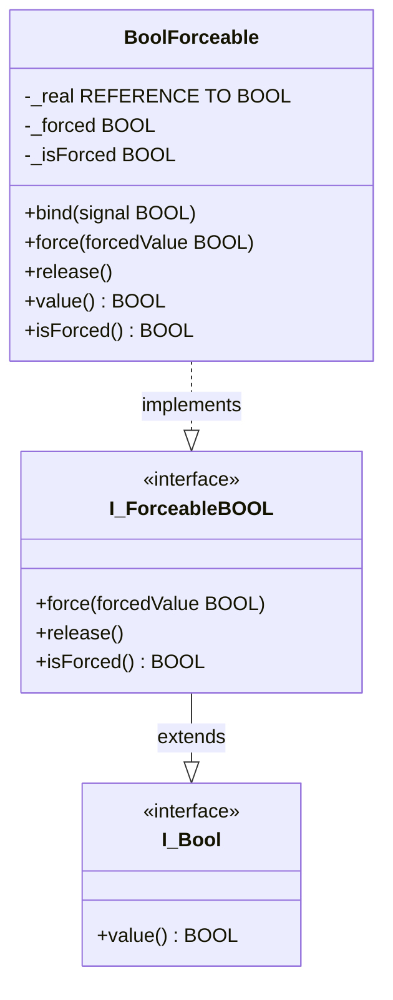

# Exercise 04a — `BoolForceable` Without the Intermediate Class

## Introduction

Exercise 04 introduced `BoolSignal` as the Real Subject in the Proxy pattern, with `BoolForceable` extending it. The separation made the pattern structurally legible as a teaching example. But ask the practical question: **is `BoolSignal` ever used standalone?**

In the current framework the answer is no. Every hardware-mapped BOOL will always be a `BoolForceable`. The non-forced state (`_isForced = FALSE`) is just `BoolForceable`'s natural resting behaviour — it does not require a separate class to exist. `BoolSignal` is premature abstraction.

Robert C. Martin on the Single Responsibility Principle states that a module should have one reason to change. `BoolSignal` currently has only one reason to exist: to be extended by `BoolForceable`. That is not a responsibility — it is structural overhead.

The relevant design heuristic from the XP community:

> *"You Aren't Gonna Need It."*
> — Ron Jeffries, *Extreme Programming Installed*, 2001

Do not build an abstraction before you have a second concrete use case for it. If a second non-forceable `I_Bool` consumer appears later, `BoolSignal` can be extracted from `BoolForceable` at that point with a trivial refactor. Until then, one class is better than two.

This exercise removes `BoolSignal` and shows the resulting simplification.

---

## Concepts Introduced

### What changes and what does not

Removing `BoolSignal` consolidates its two responsibilities — holding `_real` and implementing `bind` — directly into `BoolForceable`. The interface hierarchy (`I_Bool`, `I_ForceableBOOL`) is untouched. `DigitalInputNC` is untouched. `ForceableExample` is untouched.

The only change is that `BoolForceable` no longer says `EXTENDS BoolSignal`. Instead of calling `SUPER^.value` in the non-forced path, it reads `_real` directly.

| | Exercise 04 | Exercise 04a |
|---|---|---|
| `BoolSignal` | Present — Real Subject | **Removed** |
| `BoolForceable` | `EXTENDS BoolSignal` | `IMPLEMENTS I_ForceableBOOL` directly |
| `_real` | In `BoolSignal` | **In `BoolForceable`** |
| `bind` | In `BoolSignal` | **In `BoolForceable`** |
| Non-forced path | `SUPER^.value` | `_real` read directly |
| Interfaces | Unchanged | Unchanged |
| `DigitalInputNC` | Unchanged | Unchanged |

---

## Architecture



`BoolForceable` now implements `I_ForceableBOOL` directly. Because `I_ForceableBOOL EXTENDS I_Bool`, `BoolForceable` also satisfies `I_Bool` without any extra declaration. One class, one inheritance arrow, same external contract as before.

---

## Step-by-Step Guide

### Prerequisites
- Exercise 04 completed — the full `BoolSignal` / `BoolForceable` / `DigitalInputNC` hierarchy in place

---

### Step 1 — Rewrite `BoolForceable`

Open `BoolForceable`. Change the declaration line to remove `EXTENDS BoolSignal`:

```iecst
{attribute 'no_explicit_call' := 'BoolForceable is a class, do not call this POU directly, use a method'}
{attribute 'hide_all_locals'}
FUNCTION_BLOCK BoolForceable IMPLEMENTS I_ForceableBOOL
VAR
    _real     : REFERENCE TO BOOL;
    _forced   : BOOL;
    _isForced : BOOL;
END_VAR
```

Add the `bind` method (previously in `BoolSignal`):

```iecst
METHOD bind
VAR_IN_OUT
    signal : BOOL;
END_VAR
_real REF= signal;
```

Update the `value` property — replace `SUPER^.value` with a direct reference read:

```iecst
IF _isForced THEN
    value := _forced;
ELSIF __ISVALIDREF(_real) THEN
    value := _real;
END_IF
```

The `__ISVALIDREF` guard is now explicit rather than hidden inside a parent class. This is a small clarity gain: the complete value logic is visible in one method with no inherited behaviour to trace.

The `force`, `release`, and `isForced` members are unchanged.

---

### Step 2 — Delete `BoolSignal`

Remove `BoolSignal.TcPOU` from the `Forceable` folder and remove its entry from the `.plcproj` file. The project will compile without it — `BoolForceable` no longer references it.

---

### Step 3 — Verify nothing else changed

`DigitalInputNC` still declares `_signal : BoolForceable` and calls `_signal.bind(_input)` in `FB_Init`. No change needed there — `bind` still exists on `BoolForceable`, just implemented directly rather than inherited.

`ForceableExample` still calls `input.signal.force(...)`, `.release()`, `.isForced`, and `.value` through `I_ForceableBOOL`. No change needed there either.

Build and confirm zero errors.

---

## What to Observe

The observable behaviour of `ForceableExample` is identical to Exercise 04. The only difference is that the call chain for `input.signal.value` no longer passes through a `SUPER^` dispatch — it resolves in one step inside `BoolForceable.value`. This has no runtime significance in TwinCAT but removes one level of indirection from the mental model.

---

## When to Reintroduce `BoolSignal`

The right moment to add `BoolSignal` back is when you have a **second concrete use case** for a non-forceable `I_Bool` wrapper — for example:

- A sensor whose value must never be overridable (safety input, certified measurement)
- A simulated signal in a test harness that should not expose the `force` method
- Any place where a consumer must hold `I_Bool` and the type system should prevent accidental forcing

At that point, extract `_real` and `bind` from `BoolForceable` into `BoolSignal`, make `BoolForceable` extend it, and you are back to the Exercise 04 structure — but now with a real reason for both classes to exist.

Refactoring is inexpensive. Building for hypothetical future requirements is not.
