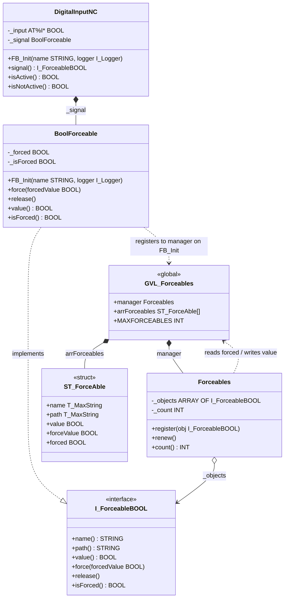

# Exercise 05 — Registry and Self-Registration: the Central Forceables List

## Introduction

> *"I want all BoolForceable instances to automatically register to a central list so that I can see and change them from the HMI."*

Exercise 04 established `BoolForceable` as a Proxy that intercepts reads of a hardware-mapped BOOL. A commissioning engineer can call `input.signal.force(FALSE)` in online view — but only if they know which object to navigate to. On a real machine with 80 inputs, 24 outputs, and 12 modules, manually locating each forceable object is impractical.

What is needed is a **registry**: a single, well-known location that knows about every `BoolForceable` instance in the program. The HMI reads from and writes to the registry. The registry propagates commands to the actual objects every scan. And crucially, objects announce themselves to the registry during construction — no external code needs to maintain the list.

By the end of this exercise you will have:

- `Forceables` — the registry manager, holding an array of `I_ForceableBOOL` references
- `GVL_Forceables` — global access point: the `manager` instance and the HMI-visible `arrForceables` array
- `ST_ForceAble` — the HMI-facing struct per entry: name, path, current value, forced flag, force value
- `BoolForceable.FB_Init` — auto-registers with the manager when a non-empty name is provided
- `DigitalInputNC.FB_Init` — propagates the device name into the signal, triggering registration
- `MAIN` — calls `GVL_Forceables.manager.renew()` every scan

---

## Concepts Introduced

### 1. The Registry pattern

Martin Fowler defines the Registry pattern in *Patterns of Enterprise Application Architecture* (2002):

> *"A well-known object that other objects can use to find common objects and services."*
> — Martin Fowler, *Patterns of Enterprise Application Architecture*, 2002

A registry is not the same as a global variable. A global variable is raw shared state. A registry is a structured service: it has a defined API (`register`, `renew`, `count`), it owns the storage of references, and it provides a controlled interface for the HMI. The intent is accessibility, not just persistence.

`Forceables` IS a registry:
- It holds `I_ForceableBOOL` references — not concrete types
- It provides `register` / `renew` — structured access, not raw array writes
- Its storage (`_objects`) is private; only the HMI-facing `GVL_Forceables.arrForceables` is public

---

### 2. Self-Registration

Classic registration requires the caller to know about every object:
```iecst
// manual — the caller must know all objects
GVL_Forceables.manager.register(noInput.signal);
GVL_Forceables.manager.register(ncInput.signal);
```

Self-registration moves this into the object's constructor. Every `BoolForceable` with a non-empty name registers itself in its `FB_Init`:

```iecst
// BoolForceable.FB_Init
IF name <> '' THEN
    GVL_Forceables.manager.register(THIS^);
END_IF
```

TwinCAT automatically calls `Base.FB_Init` (and any other base in the chain) before this body runs — no explicit `SUPER^.FB_Init` call is needed. `_name` is already set by the time the registration line executes. Adding a `SUPER^.FB_Init` call in the body would invoke the base constructor a second time.

The name guard is the critical detail. When no inline arguments are provided to a member FB, TwinCAT calls its `FB_Init` with empty defaults — and the guard prevents a spurious registration with `name = ''`. With the inline declaration `_signal : BoolForceable(CONCAT(name, ' forceable'), GVL_Logger.Logger)`, TwinCAT uses the `FB_Init` parameter of the *containing* FB as the first argument, so the name is non-empty and registration fires immediately during member initialization.

The explicit `_signal.FB_Init(...)` call in the body then refines the entry: it updates the name to just `name` (without the ` forceable` suffix) and replaces the global logger with the caller-injected one if provided. The duplicate-safe `register` method finds the existing entry for the same reference and updates it.

---

### 3. The initialization order — two-phase registration

TwinCAT's initialization sequence for `DigitalInputNC` with the inline declaration:

```
1. Member FBs initialized in declaration order using inline FB_Init args:
       _signal.FB_Init(FALSE, FALSE, CONCAT('Door sensor', ' forceable'), GVL_Logger.Logger)
   → name = 'Door sensor forceable' → guard passes → first registration fires
       arrForceables[0].name = 'Door sensor forceable'

2. DigitalInputNC.FB_Init body runs:
       _signal.FB_Init(FALSE, FALSE, 'Door sensor', logger)
   → name = 'Door sensor' → guard passes → register called again
   → duplicate guard finds existing reference → updates name
       arrForceables[0].name = 'Door sensor'   ← refined to final name
       _signal.bind(_input)                    ← hardware reference bound
```

The inline declaration guarantees registration even if the device programmer omits the explicit `_signal.FB_Init(...)` call — the signal always has at least the `' forceable'`-suffixed name and `GVL_Logger.Logger` as a fallback. The explicit call is still recommended: it provides the clean device name and allows logger DI.

---

### 4. The HMI bridge — `ST_ForceAble` and `GVL_Forceables`

The registry holds `I_ForceableBOOL` interface references — types that an HMI cannot directly display or write. `ST_ForceAble` is the translation layer: a plain struct the HMI can read and write freely.

```
ST_ForceAble
  name       : T_MaxString   ← read-only from HMI, populated at registration
  path       : T_MaxString   ← read-only from HMI, populated at registration
  value      : BOOL          ← read-only from HMI, updated by renew() each scan
  forced     : BOOL          ← HMI writes TRUE to enable forcing
  forceValue : BOOL          ← HMI writes the desired forced value
```

`GVL_Forceables.arrForceables` is an array of these structs, one per registered object. The HMI binds directly to this array by index.

`Forceables.renew()` runs every PLC scan and synchronises in both directions:
1. Reads `forced` and `forceValue` from the struct → calls `force()` or `release()` on the object
2. Reads `value` from the object → writes to the struct (so the HMI sees the current effective value)

---

### 5. Duplicate registration guard

The automatic member FB_Init runs first (with empty name, blocked by guard). The explicit call runs second (with real name, registration happens). If the same object is somehow registered twice, the `register` method handles it gracefully: it scans the existing array and updates the name/path if the reference is already present, rather than adding a duplicate.

---

### 6. Relation to exercise 03 — Registry vs Singleton

In exercise 03 we rejected the global singleton logger (`GVL.G_Logger`) in favour of dependency injection. Here we deliberately use a global registry. Is this a contradiction?

No. The distinction is **why** something is global:

| | Exercise 03 global logger (rejected) | Exercise 05 Forceables registry (accepted) |
|---|---|---|
| Why global | Convenience — avoids wiring | **Requirement** — the HMI must be able to see ALL instances from one place |
| Replaceability | Must be swappable (logger type varies) | Always the same registry; contents vary |
| Coupling | `Base` would depend on a specific logger | `BoolForceable` depends on the registration service, not on a specific implementation |
| Alternative | DI solves it cleanly | There is no alternative to a shared list |

A registry of forceable objects is genuinely a singleton-responsibility thing: there is one machine, one set of signals, one HMI. Duplicating registries or injecting them would add complexity without benefit. The global is justified by the requirement.

---

## Architecture



The dashed arrows show the runtime data flows: `BoolForceable` registers during construction; `Forceables.renew()` bidirectionally syncs the structs and the objects every scan.

### Sequence: registration (two-phase)

```
Phase 1 — inline VAR declaration (before DigitalInputNC.FB_Init runs):
  _signal.FB_Init(FALSE, FALSE, 'Door sensor forceable', GVL_Logger.Logger)
    │
    ├─► [automatic] Base.FB_Init(...)   // _name = 'Door sensor forceable'
    └─► GVL_Forceables.manager.register(THIS^)
            └─► _objects[0] = _signal
                arrForceables[0].name = 'Door sensor forceable'
                arrForceables[0].path = 'ForceableExample.input._signal'

Phase 2 — DigitalInputNC.FB_Init('Door sensor', logger) body:
  │
  ├─► _signal.FB_Init(FALSE, FALSE, 'Door sensor', logger)
  │       │
  │       ├─► [automatic] Base.FB_Init(...)   // _name = 'Door sensor'
  │       └─► GVL_Forceables.manager.register(THIS^)
  │               └─► duplicate found → name updated to 'Door sensor'
  │
  └─► _signal.bind(_input)          // binds hardware reference
```

### Sequence: renew (every scan)

```
MAIN → GVL_Forceables.manager.renew()
  │
  └─► for each registered object:
        if arrForceables[i].forced:
            _objects[i].force(arrForceables[i].forceValue)
        else:
            _objects[i].release()
        arrForceables[i].value := _objects[i].value
```

---

## Step-by-Step Guide

### Prerequisites

- Exercise 04 completed — `BoolSignal`, `BoolForceable`, `I_Bool`, `I_ForceableBOOL`, `DigitalInputNC` in place
- [TwinCAT coding style](TwinCAT-coding-style.md) at hand

---

### Step 1 — Add `name` and `path` to `I_ForceableBOOL`

Open `I_ForceableBOOL`. Add two read-only properties:

```iecst
PROPERTY name : STRING
PROPERTY path : STRING
```

`BoolForceable` already satisfies both — it inherits `name` and `path` from `Base` via `BoolSignal`. Adding them to the interface makes them accessible to any caller holding `I_ForceableBOOL`, including `Forceables.register`.

---

### Step 2 — Create the `ForceAbles` folder and `ST_ForceAble`

Right-click `PLC_FrameworkOOP` → **Add** → **Folder**. Name: `ForceAbles`.

Right-click `ForceAbles` → **Add** → **DUT**. Name: `ST_ForceAble`. Type: Structure.

```iecst
TYPE ST_ForceAble :
STRUCT
    name       : T_MaxString;
    path       : T_MaxString;
    value      : BOOL;
    forceValue : BOOL;
    forced     : BOOL;
END_STRUCT
END_TYPE
```

`name` and `path` are filled once at registration and never change. `value` is updated every scan by `renew()`. The HMI operator reads `name`/`path` for identification, reads `value` for current state, and writes `forced`/`forceValue` to command a force.

---

### Step 3 — Create `Forceables` (the registry manager)

Right-click `ForceAbles` → **Add** → **Function Block**. Name: `Forceables`. Add both class pragmas.

**Declaration:**

```iecst
{attribute 'no_explicit_call' := 'Forceables is a class, do not call this POU directly, use a method'}
{attribute 'hide_all_locals'}
FUNCTION_BLOCK Forceables
VAR
    _objects : ARRAY[0..GVL_Forceables.MAXFORCEABLES - 1] OF I_ForceableBOOL;
    _count   : INT;
END_VAR
```

**`register` method:**

```iecst
METHOD register
VAR_INPUT
    obj : I_ForceableBOOL;
END_VAR
VAR
    i : INT;
END_VAR
IF obj = 0 THEN
    RETURN;
END_IF
FOR i := 0 TO GVL_Forceables.MAXFORCEABLES - 1 DO
    IF _objects[i] = obj THEN
        GVL_Forceables.arrForceables[i].name := obj.name;
        GVL_Forceables.arrForceables[i].path := obj.path;
        RETURN;
    END_IF
    IF _objects[i] = 0 THEN
        _objects[i] := obj;
        GVL_Forceables.arrForceables[i].name := obj.name;
        GVL_Forceables.arrForceables[i].path := obj.path;
        GVL_Forceables.arrForceables[i].value := obj.value;
        _count := _count + 1;
        RETURN;
    END_IF
END_FOR
```

The single loop handles both cases: if the object is already registered (same reference found), the name/path are refreshed and we return early. If an empty slot is found first, it is the new registration. This prevents duplicate entries even if `register` is called multiple times for the same object.

**`renew` method:**

```iecst
METHOD renew
VAR
    i : INT;
END_VAR
FOR i := 0 TO GVL_Forceables.MAXFORCEABLES - 1 DO
    IF _objects[i] = 0 THEN
        CONTINUE;
    END_IF
    IF GVL_Forceables.arrForceables[i].forced THEN
        _objects[i].force(GVL_Forceables.arrForceables[i].forceValue);
    ELSE
        _objects[i].release();
    END_IF
    GVL_Forceables.arrForceables[i].value := _objects[i].value;
END_FOR
```

`CONTINUE` skips empty slots efficiently. The value update happens **after** force/release so the struct always reflects the effective (possibly forced) value, not the hardware value.

**`count` property:**

```iecst
PROPERTY count : INT
// GET:
count := _count;
```

---

### Step 4 — Create `GVL_Forceables`

Right-click `ForceAbles` → **Add** → **Global Variable List**. Name: `GVL_Forceables`.

```iecst
{attribute 'qualified_only'}
VAR_GLOBAL
    manager       : Forceables;
    arrForceables : ARRAY[0..MAXFORCEABLES - 1] OF ST_ForceAble;
END_VAR

VAR_GLOBAL CONSTANT
    MAXFORCEABLES : INT := 100;
END_VAR
```

`manager` is the singleton registry instance. `arrForceables` is the HMI-facing array. `{attribute 'qualified_only'}` ensures all access is via `GVL_Forceables.X` — preventing accidental bare-name collisions.

> **Why not `VAR_GLOBAL CONSTANT` for `MAXFORCEABLES`?** A constant is correct here — the array size is fixed at compile time and cannot change at runtime. This is the appropriate use of a constant: a structural invariant that is determined by the hardware architecture of the machine. See exercise 03a for the full parameter list vs constant discussion.

---

### Step 5 — Add `FB_Init` to `BoolForceable`

Open `BoolForceable`. Add an `FB_Init` method that chains the base constructor and conditionally self-registers:

```iecst
METHOD FB_Init : BOOL
VAR_INPUT
    bInitRetains : BOOL;
    bInCopyCode  : BOOL;
    name         : STRING;
    logger       : I_Logger;
END_VAR
IF name <> '' THEN
    GVL_Forceables.manager.register(THIS^);
END_IF
```

TwinCAT automatically calls `Base.FB_Init` (via `BoolSignal`) before this body runs, so `_name` is already set when the registration line executes. No explicit `SUPER^.FB_Init` call belongs here — adding one would invoke the base constructor twice.

The `name <> ''` guard is the safety net: if `BoolForceable` is ever declared *without* inline arguments (e.g. as a standalone variable somewhere), TwinCAT would call `FB_Init` with an empty string and the guard prevents a registration with no identity. When the inline `CONCAT(name, ' forceable')` syntax is used, the guard always passes because the composed string is non-empty as long as the device name is set.

---

### Step 6 — Update `DigitalInputNC`

Open `DigitalInputNC`. Update the `_signal` declaration to use the inline `FB_Init` syntax, passing a composed name and the global logger:

```iecst
FUNCTION_BLOCK DigitalInputNC EXTENDS base IMPLEMENTS I_DigitalInput
VAR
    _input  AT %I* : BOOL;
    _signal : BoolForceable(CONCAT(name, ' forceable'), GVL_Logger.Logger);
END_VAR
```

TwinCAT evaluates the inline arguments using the `FB_Init` parameters of the containing FB (`name` here refers to `DigitalInputNC.FB_Init`'s `name` parameter). This guarantees that `_signal` is registered with a meaningful name and a working logger even before the `FB_Init` body runs.

Update the `FB_Init` body to refine the signal with the final name and injected logger, then bind:

```iecst
METHOD FB_Init : BOOL
VAR_INPUT
    bInitRetains : BOOL;
    bInCopyCode  : BOOL;
    name         : STRING;
    logger       : I_Logger;
END_VAR
_signal.FB_Init(bInitRetains, bInCopyCode, name, logger);
_signal.bind(_input);
```

The second `_signal.FB_Init(...)` call updates the registered name to `name` (without the ` forceable` suffix) and replaces `GVL_Logger.Logger` with the caller-injected logger. `bind` must come after `FB_Init` so the hardware reference is set after the registration entry exists.

Any other device class that owns a `BoolForceable` follows this same two-step pattern in its VAR block and `FB_Init` body.

---

### Step 7 — Call `renew` from `MAIN`

Open `MAIN`. Add the registry sync call:

```iecst
PROGRAM MAIN
DevicesExample();
ForceableExample();
GVL_Forceables.manager.renew();
```

`renew()` must run every scan to keep the HMI view current and to apply any force commands the operator wrote to the struct array. Its position after the program calls ensures all device logic has run before the sync.

---

## What to Observe After Implementation

1. Run the program — in the TwinCAT online view, expand `GVL_Forceables.arrForceables`. Slots 0, 1, and 2 should show names `'Door sensor'`, `'I201.1'` (if `DevicesExample` inputs also have `BoolForceable`), etc., with their runtime paths
2. Check `GVL_Forceables.manager.count` — it shows how many objects successfully registered
3. In the HMI (or online view), set `arrForceables[0].forced := TRUE` and `arrForceables[0].forceValue := FALSE` — after the next `renew()` call, `arrForceables[0].value` reflects the forced value, and `ForceableExample.isActive` responds accordingly
4. Set `arrForceables[0].forced := FALSE` — the next `renew()` releases the force and `value` returns to hardware

---

## Design Notes

**`MAXFORCEABLES = 100` is a constant, not a parameter.**
The array size is a structural decision made at compile time. You can change it, but doing so requires a code download. This is correct — it is not a commissioning parameter. See exercise 03a for the full argument.

**The registry knows nothing about `DigitalInputNC`.**
`Forceables` holds `I_ForceableBOOL` references only. It does not know what device class owns each signal. Adding a new device type with a `BoolForceable` member costs two lines in its `FB_Init` — the registry code is unchanged.

**`renew()` applies forces unconditionally every scan.**
If the operator sets `forced = TRUE` once, `force()` is called on that object every scan until `forced` is cleared. This is intentional: the forced state must survive an online change (which may reinitialize some variables). The struct persists; the interface reference may need re-registration after an online change if the TwinCAT runtime invalidates the reference.
