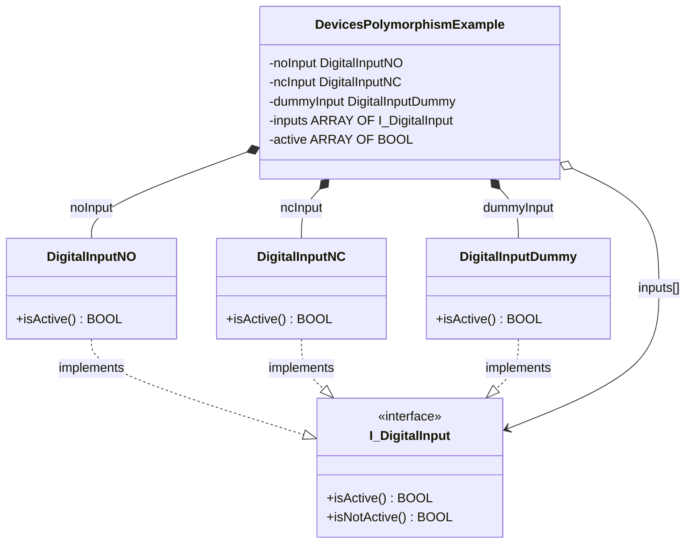

# Exercise 06 — Polymorphism: One Loop, Three Types

## Introduction

> *"I want to write application code that reads any digital input the same way, without caring whether it is normally open, normally closed, or a placeholder."*

Exercises 01–05 built three classes that all implement `I_DigitalInput`. Every example so far has called each one individually: `noInput.isActive`, `ncInput.isActive`, `dummyInput.isActive`. The interface is defined, the contract is stated — but the core payoff of having an interface has not been shown yet.

That payoff is **polymorphism**: code that calls `isActive` on an `I_DigitalInput` reference works correctly regardless of what concrete object sits behind it — without if-statements, without type checks, without any modification to the calling code.

By the end of this exercise you will have:

- `DevicesPolymorphismExample` — a program that holds an `ARRAY[0..2] OF I_DigitalInput`, assigns all three concrete types to it, and reads all of them in a single loop
- A direct observation that the same `isActive` call returns the correct inverted value for NC, the direct value for NO, and always `TRUE` for Dummy — all from the same loop body

---

## Concepts Introduced

### 1. Polymorphism

Polymorphism (from the Greek *many forms*) means that one interface can have many implementations, and calling code need not know which implementation it holds. In TwinCAT, an `I_DigitalInput` variable stores a **pointer** to whatever function block was assigned to it. At runtime, `inputs[i].isActive` dispatches to the `isActive` getter of whichever concrete class is stored at position `i` — this is **virtual dispatch** through the interface's vtable.

No conditional logic is needed:

```iecst
// Works correctly for NO, NC, and Dummy — same code, different behaviour
active[i] := inputs[i].isActive;
```

### 2. Liskov Substitution Principle

The Liskov Substitution Principle (Barbara Liskov, 1987 — SOLID **L**) states:

> *If S is a subtype of T, then objects of type S may be substituted for objects of type T without altering the correctness of the program.*

Applied here: `DigitalInputNO`, `DigitalInputNC`, and `DigitalInputDummy` are all subtypes of `I_DigitalInput`. Any code correct for `I_DigitalInput` must be correct for any of the three — and it is. The NC class inverts its input; the NO class passes it through; the Dummy always returns `TRUE`. The loop does not care which is which.

The practical test for LSP: **substitute any concrete type and the behaviour remains correct from the caller's perspective.**

### 3. Interface references in TwinCAT

A variable declared as `I_DigitalInput` holds a pointer to the underlying function block instance. The assignment:

```iecst
inputs[0] := noInput;
```

does not copy the object — it stores a pointer to `noInput` in `inputs[0]`. The pointer is stable for the lifetime of the scan program. Calling `inputs[0].isActive` dispatches through the interface vtable to `DigitalInputNO.isActive`.

The null check `inputs[i] <> 0` guards against unassigned slots. TwinCAT initialises interface variables to `0` (null pointer); a null dereference causes a runtime exception.

---

## Architecture



The `inputs` array holds interface pointers. The concrete instances are members of the same program — their addresses are stable across scans.

---

## Step-by-Step Guide

### Prerequisites

- Exercise 01 completed — `I_DigitalInput`, `DigitalInputNO`, `DigitalInputNC`, `DigitalInputDummy` in place
- [TwinCAT coding style](TwinCAT-coding-style.md) at hand

---

### Step 1 — Create `DevicesPolymorphismExample`

Right-click the `Devices` folder → **Add** → **Program**. Name: `DevicesPolymorphismExample`.

**Declaration:**

```iecst
PROGRAM DevicesPolymorphismExample
VAR
    noInput    : DigitalInputNO('Poly.NO', GVL_Logger.logger);
    ncInput    : DigitalInputNC('Poly.NC', GVL_Logger.logger);
    dummyInput : DigitalInputDummy('Poly.Dummy', GVL_Logger.logger);

    inputs      : ARRAY[0..2] OF I_DigitalInput;
    active      : ARRAY[0..2] OF BOOL;

    i           : INT;
    initialized : BOOL;
END_VAR
```

`inputs` is an array of interface references — it can hold any combination of `DigitalInputNO`, `DigitalInputNC`, and `DigitalInputDummy` instances. The array index does not encode the type.

`initialized` is a first-scan flag. The concrete-to-interface assignments happen once; the array is stable for the rest of the program's lifetime.

---

### Step 2 — Write the program body

```iecst
IF NOT initialized THEN
    inputs[0] := noInput;
    inputs[1] := ncInput;
    inputs[2] := dummyInput;
    initialized := TRUE;
END_IF

FOR i := 0 TO 2 DO
    IF inputs[i] <> 0 THEN
        active[i] := inputs[i].isActive;
    END_IF
END_FOR
```

The `IF NOT initialized` block runs exactly once on the first scan. After this, `inputs[0..2]` each hold a stable pointer to their concrete object.

The `FOR` loop is the core of the exercise. Three devices, one loop body, no type-switch. The `isActive` call dispatches differently for each:

| `inputs[i]` | `isActive` returns |
|---|---|
| `DigitalInputNO` | `_input` — follows hardware directly |
| `DigitalInputNC` | `NOT _signal.value` — inverted, possibly forced |
| `DigitalInputDummy` | `TRUE` always |

---

### Step 3 — Call from `MAIN`

Open `MAIN`. Add the new program call before the `renew()`:

```iecst
PROGRAM MAIN

DevicesExample();
ForceableExample();
DevicesPolymorphismExample();
GVL_Forceables.manager.renew();
```

---

## What to Observe in Online View

1. Open `DevicesPolymorphismExample` — `active[0]`, `active[1]`, `active[2]` are all visible
2. `active[2]` (Dummy) is always `TRUE` regardless of hardware
3. Toggle the hardware input mapped to `noInput` — `active[0]` follows directly
4. Toggle the hardware input mapped to `ncInput` — `active[1]` inverts the signal
5. Force `ncInput` via `GVL_Forceables.arrForceables` — `active[1]` reflects the forced value; `active[0]` and `active[2]` are unaffected
6. Swap the assignments: put `ncInput` at index 0 and `noInput` at index 1 — `active[0]` now inverts; `active[1]` follows directly — **the loop body is unchanged**

Point 6 is the proof of polymorphism: the calling code did not change. The behaviour changed because a different implementation was placed behind the same interface reference. This is Liskov Substitution in action.
