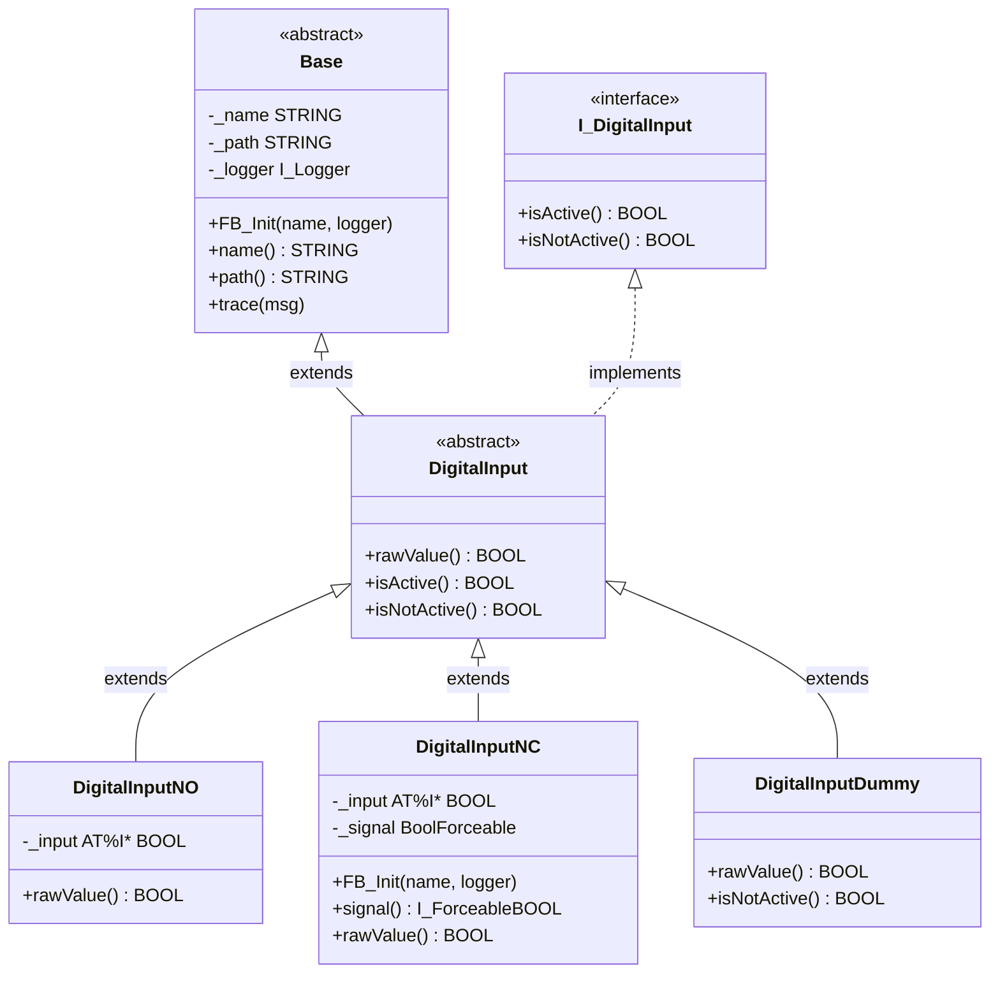

# Exercise 07 — Template Method: Abstract Base Class for Digital Inputs

## Introduction

> *"I don't want every digital input subclass to independently define what `isNotActive` means — it should always be the complement of `isActive`, everywhere, by construction."*

After exercise 06, three classes implement `I_DigitalInput`. Each one defines `isActive` and `isNotActive` separately. The relationship between them — `isNotActive` must always equal `NOT isActive` — is a convention enforced only by programmer discipline. A future `DigitalInputFromNetwork` class could implement both properties inconsistently and the compiler would not object.

The Template Method pattern solves this. An abstract base class defines the **algorithm skeleton**: `isActive := rawValue` and `isNotActive := NOT rawValue`. The variable step — "what is the normalised signal value for this wiring type?" — is declared abstract and left for each concrete class to fill in. Subclasses implement one property instead of two, and the invariant is structural.

By the end of this exercise you will have:

- `DigitalInput` — an abstract function block that extends `Base`, implements `I_DigitalInput`, and defines `isActive` and `isNotActive` as concrete properties derived from an abstract `rawValue`
- `DigitalInputNO` and `DigitalInputNC` refactored to extend `DigitalInput`, each implementing only `rawValue`
- `DigitalInputDummy` refactored to extend `DigitalInput`, implementing `rawValue` and overriding `isNotActive` to preserve its original both-`TRUE` behaviour

---

## Concepts Introduced

### 1. The Template Method pattern

The Template Method pattern (GoF) defines the skeleton of an algorithm in a base class, deferring specific steps to subclasses:

> *"Define the skeleton of an algorithm in an operation, deferring some steps to subclasses. Template Method lets subclasses redefine certain steps of an algorithm without changing the algorithm's structure."*
> — Gang of Four, *Design Patterns*, 1994

In this exercise the "algorithm" is: *read the underlying signal, expose it as active / not-active*. The skeleton lives in the abstract base:

```iecst
PROPERTY isActive    : BOOL  →  isActive    := rawValue;
PROPERTY isNotActive : BOOL  →  isNotActive := NOT rawValue;
```

The variable step — reading and normalising the underlying signal — is abstract:

```iecst
ABSTRACT PROPERTY rawValue : BOOL
```

Subclasses fill in `rawValue` and get `isActive` and `isNotActive` for free. The relationship between the two properties is enforced by the base, not by convention.

**SOLID O — Open/Closed Principle:** `DigitalInput` is closed for modification. Adding a new input type (e.g. `DigitalInputFromNetwork`) requires no changes to the base — only a new subclass with one property.

---

### 2. Abstract function blocks in TwinCAT

The `ABSTRACT` keyword before `FUNCTION_BLOCK` tells the compiler two things:
- This type cannot be instantiated directly
- It may declare abstract properties and methods that concrete subclasses must implement

```iecst
ABSTRACT FUNCTION_BLOCK DigitalInput EXTENDS Base IMPLEMENTS I_DigitalInput
```

Attempting to declare a variable of type `DigitalInput` produces a compiler error. The only valid use is as an `EXTENDS` target in a concrete subclass declaration.

The `{attribute 'no_explicit_call'}` pragma still applies — an abstract class is still a class in the framework sense. The pragma message now has two jobs: it prevents direct calls and it tells the programmer what to do instead:

```iecst
{attribute 'no_explicit_call' := 'DigitalInput is an abstract class — extend it and implement rawValue'}
```

---

### 3. Abstract properties in TwinCAT

An abstract property is declared with the `ABSTRACT` keyword and carries no implementation body — only the signature:

```iecst
ABSTRACT PROPERTY rawValue : BOOL
```

The compiler tracks which abstract members remain unimplemented. A concrete subclass that extends an abstract base and does not provide a body for every abstract member produces a **C0321** compile error: *"The abstract method … has to be implemented"*. This is compile-time enforcement of the subclass contract — the same guarantee that `IMPLEMENTS` gives for interfaces, but now coming from the base class side.

---

### 4. How the inheritance hierarchy changes

Before this exercise, all three concrete classes inherit directly from `Base`:

```
Base (abstract)
  ↑ extends
DigitalInputNO  IMPLEMENTS I_DigitalInput
DigitalInputNC  IMPLEMENTS I_DigitalInput
DigitalInputDummy  IMPLEMENTS I_DigitalInput
```

After this exercise, `DigitalInput` sits between `Base` and the concrete classes:

```
Base (abstract)
  ↑ extends
DigitalInput (abstract)  IMPLEMENTS I_DigitalInput
  ↑ extends
DigitalInputNO
DigitalInputNC
DigitalInputDummy
```

The concrete classes no longer declare `IMPLEMENTS I_DigitalInput` — it is inherited from `DigitalInput`. The compiler still enforces the full `I_DigitalInput` contract; the declaration simply moves up one level. From the outside — through interface references, through `DevicesExample`, through `DevicesPolymorphismExample` — nothing changes.

---

### 5. `DigitalInputDummy` — overriding a concrete template step

Exercise 01 designed `DigitalInputDummy` to return `TRUE` for both `isActive` and `isNotActive` — a deliberate logical inconsistency that makes it maximally permissive. Without intervention, joining the abstract hierarchy would change this: `rawValue := TRUE` means `isNotActive = NOT TRUE = FALSE`, losing the both-`TRUE` behaviour.

`DigitalInputDummy` explicitly overrides the `isNotActive` property from the base to return `TRUE` regardless of `rawValue`. This preserves the original Null Object semantics: no condition that tests `isActive` or `isNotActive` will ever block execution against a dummy.

In TwinCAT, all properties on function blocks dispatch virtually — when `isNotActive` is called on a `DigitalInputDummy` instance or through an `I_DigitalInput` reference, the runtime calls `DigitalInputDummy.isNotActive`, not `DigitalInput.isNotActive`. The override is effective through the interface.

> **Note — `DigitalInputDummy` is the intentional exception to the template.**
> `DigitalInputNO` and `DigitalInputNC` implement `rawValue` and inherit everything else. `DigitalInputDummy` implements `rawValue` *and* overrides `isNotActive`. This is not a violation of the pattern — the GoF explicitly allows subclasses to override concrete template steps when they have a justified reason to deviate. The justification here is the Null Object contract: a placeholder must never block code flow regardless of which property is tested. Any future subclass that overrides a concrete step from `DigitalInput` without an equivalent justification should be treated as a design smell.

---

## Architecture



`rawValue` is shown in `DigitalInput` as the abstract hook — the one step each subclass must fill in. `isActive` and `isNotActive` appear only in `DigitalInput` for `DigitalInputNO` and `DigitalInputNC` — they are inherited, not overridden. `DigitalInputDummy` shows `isNotActive` explicitly because it overrides the inherited concrete implementation.

---

## Step-by-Step Guide

### Prerequisites

- Exercises 01–05 completed — `Base`, `I_DigitalInput`, `DigitalInputNO`, `DigitalInputNC`, `DigitalInputDummy`, `BoolForceable` all in place
- [TwinCAT coding style](TwinCAT-coding-style.md) at hand

---

### Step 1 — Create `DigitalInput`

Right-click the `Devices` folder → **Add** → **Function Block**. Name: `DigitalInput`.

Add both class pragmas at the top. Write the `no_explicit_call` message to explain that this type is abstract and name what to do instead.

Declare the function block `ABSTRACT`, `EXTENDS Base`, `IMPLEMENTS I_DigitalInput`. Delete any empty VAR blocks added automatically by TwinCAT.

Declare `rawValue` as an `ABSTRACT PROPERTY` returning `BOOL` (read-only getter, no setter). This is the only abstract member — the one step deferred to subclasses.

Add a concrete `isActive` property. Its getter returns `rawValue`.

Add a concrete `isNotActive` property. Its getter returns `NOT rawValue`.

No VAR block — `DigitalInput` introduces no new member variables. No `FB_Init` override — `Base.FB_Init` covers all initialisation this level needs, and `DigitalInput` has no new state to initialise.

Register `Devices\DigitalInput.TcPOU` in `PLC_FrameworkOOP.plcproj`.

---

### Step 2 — Update `DigitalInputNO`

Open `DigitalInputNO`.

In the declaration line: change `EXTENDS Base` to `EXTENDS DigitalInput`. Remove `IMPLEMENTS I_DigitalInput` — it is now inherited.

Delete the `isActive` property entirely. Delete the `isNotActive` property entirely.

Add a `rawValue` property. Its getter returns the hardware input directly. This is the only property `DigitalInputNO` authors after this change.

---

### Step 3 — Update `DigitalInputNC`

Open `DigitalInputNC`.

In the declaration line: change `EXTENDS Base` to `EXTENDS DigitalInput`. Remove `IMPLEMENTS I_DigitalInput`.

Delete the `isActive` and `isNotActive` properties.

Add a `rawValue` property. Its getter returns the inverted signal value — the inversion logic that previously lived in the `isActive` getter moves here unchanged.

Leave everything else untouched: the `FB_Init` method, the `signal` property, the `_signal` member declaration, and the `_input` hardware variable.

---

### Step 4 — Update `DigitalInputDummy`

> **`DigitalInputDummy` is the intentional exception in this exercise.** It implements the abstract hook like the other two classes, and then explicitly overrides one concrete template step. Read concept 5 before this step.

Open `DigitalInputDummy`.

In the declaration line: change `EXTENDS Base` to `EXTENDS DigitalInput`. Remove `IMPLEMENTS I_DigitalInput` if present.

Delete the existing `isActive` property — it is now inherited from the base.

Keep the existing `isNotActive` property and change its getter to return `TRUE` unconditionally. This is the override: `DigitalInputDummy.isNotActive` shadows `DigitalInput.isNotActive` and restores the original Null Object behaviour.

Add a `rawValue` property. Its getter returns `TRUE`. This satisfies the abstract contract; `isActive` will return `TRUE` through the inherited template.

After this step: `isActive` returns `TRUE` (unchanged); `isNotActive` returns `TRUE` (unchanged). The both-`TRUE` permissive behaviour is fully preserved.

No VAR block, no `FB_Init` — nothing else changes on this class.

---

### Step 5 — Verify callers are unaffected

`DevicesExample`, `DevicesPolymorphismExample`, and `ForceableExample` all interact with the concrete types through `I_DigitalInput` references or through direct instance variables. The interface contract is identical to before; the hierarchy restructure is invisible to callers.

Build the project. The expected outcome: zero compiler errors. If a **C0321** error appears on any concrete class, `rawValue` is missing or carries the wrong return type on that class.

---

## What to Observe After Implementation

1. **Abstract instantiation is blocked.** Attempt to declare a variable of type `DigitalInput` anywhere in the project — the compiler refuses. The `no_explicit_call` message tells you why and what to do instead. Abstract classes cannot be accidentally misused.

2. **The subclass contract is compile-time enforced.** Remove the `rawValue` property from `DigitalInputNO` and build — C0321 fires immediately on that class. Restore it. This is the guarantee the Template Method pattern provides through TwinCAT's abstract mechanism: the one-step contract between base and subclass is checked at every build, not discovered at runtime.

3. **Dummy behaviour is unchanged.** In online view, `DevicesExample.dummyNotActive` is still `TRUE` at all times. The override on `DigitalInputDummy` is working: the call dispatches to `DigitalInputDummy.isNotActive`, not to `DigitalInput.isNotActive`. To confirm the dispatch is correct, temporarily remove the `isNotActive` override from `DigitalInputDummy`, rebuild, and observe that `dummyNotActive` flips to `FALSE`. Restore the override.

4. **The loop is unchanged.** In `DevicesPolymorphismExample`, `active[2]` (Dummy) reads `TRUE` as before. The loop body — `active[i] := inputs[i].isActive` — did not change. Polymorphism and the template work together: the template enforces the internal invariant; the interface hides the hierarchy from the caller.
