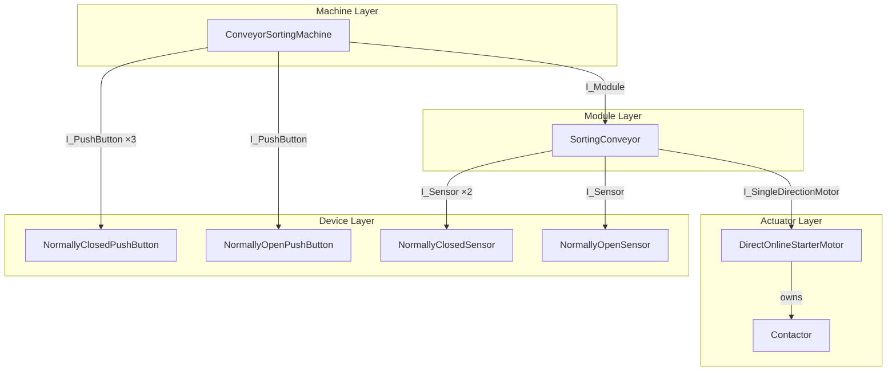
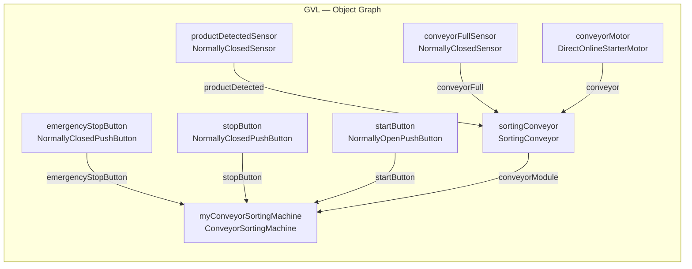

# Code Reference — Conveyor Sorting Machine

Both TwinCAT 3 PLC projects in this repository control the same conveyor sorting machine. This document walks through each project's code and explains how the OOP refactoring works.

---

## System Description

The machine has three control-panel inputs, two field sensors, and one motor output:

| Signal | Type | Wiring | GVL variable (PLC_NoOOP) | GVL variable (PLC) |
|---|---|---|---|---|
| Emergency Stop | Input | Normally Closed | `EmergencyStopButton AT%I*` | `emergencyStopButton : NormallyClosedPushButton` |
| Stop | Input | Normally Closed | `StopButton AT%I*` | `stopButton : NormallyClosedPushButton` |
| Start | Input | Normally Open | `StartButton AT%I*` | `startButton : NormallyOpenPushButton` |
| Product Detected | Input | Normally Closed | `ProductDetectedSensor AT%I*` | `productDetectedSensor : NormallyClosedSensor` |
| Conveyor Full | Input | Normally Closed | `ConveyorFullSensor AT%I*` | `conveyorFullSensor : NormallyClosedSensor` |
| Motor Contactor | Output | — | `MotorContactor AT%Q*` | `conveyorMotor : DirectOnlineStarterMotor` |

**Control logic:** The motor runs when the machine is in run mode AND the product-detected timer is active AND the conveyor is not full. Run mode is set by the Start button and cleared by Stop or Emergency Stop.

---

## Project 1 — PLC_NoOOP (Procedural)

### GVL

```iecst
{attribute 'qualified_only'}
VAR_GLOBAL
    EmergencyStopButton   AT%I* : BOOL;
    StopButton            AT%I* : BOOL;
    StartButton           AT%I* : BOOL;
    ProductDetectedSensor AT%I* : BOOL;
    ConveyorFullSensor    AT%I* : BOOL;
    MotorContactor        AT%Q* : BOOL;
END_VAR
```

Every signal is a raw `BOOL` mapped directly to a hardware address. The GVL is a flat list of hardware terminals, not a description of the machine.

### MAIN

```iecst
PROGRAM MAIN
VAR
    ConveyorControl : BOOL;
    Timeout         : TOF;
END_VAR

// Conveyor control is ok when the ES nor the stop button is pushed
IF NOT GVL.StopButton OR NOT GVL.EmergencyStopButton THEN
    ConveyorControl := FALSE;
ELSIF gvl.StartButton AND gvl.StopButton THEN
    ConveyorControl := TRUE;
END_IF

// Minimum time the conveyor keeps on running
Timeout(IN := ConveyorControl AND gvl.ProductDetectedSensor, PT := T#5S, Q =>, ET =>);

// Conveyor keeps on running until not full and some extra time
gvl.MotorContactor := ConveyorControl AND Timeout.Q AND NOT gvl.ConveyorFullSensor;
```

**Reading challenges with procedural code:**
- `NOT GVL.StopButton` — to understand this you must already know the button is normally closed. The logic leaks hardware wiring knowledge into the program.
- `gvl.StartButton AND gvl.StopButton` — the stop button appearing in the start condition (because it's NC and must be released = TRUE) is counterintuitive without context.
- `NOT gvl.ConveyorFullSensor` — same issue: the NOT is a consequence of the hardware wiring type, not the intent.

**Scalability problems:**
- Adding a second conveyor means duplicating all six GVL variables and the entire MAIN block.
- Changing a sensor from normally open to normally closed means hunting through MAIN for every reference and flipping the NOT logic.

---

## Project 2 — PLC (Object-Oriented)

### Architecture Overview

The OOP project organises code into four layers, each depending only on the layer below through interfaces:



Each arrow represents an interface dependency — the higher layer never names the concrete class it receives.

### Full Class Diagram

```mermaid
classDiagram
    direction TB

    class I_PushButton {
        <<interface>>
        +IsPressed() BOOL
        +IsReleased() BOOL
    }
    class NormallyOpenPushButton {
        -input AT %I* : BOOL
        +IsPressed() BOOL
        +IsReleased() BOOL
    }
    class NormallyClosedPushButton {
        -input AT %I* : BOOL
        +IsPressed() BOOL
        +IsReleased() BOOL
    }
    NormallyOpenPushButton ..|> I_PushButton : implements
    NormallyClosedPushButton ..|> I_PushButton : implements

    class I_Sensor {
        <<interface>>
        +IsActive() BOOL
        +IsNotActive() BOOL
    }
    class NormallyOpenSensor {
        -input AT %I* : BOOL
        +IsActive() BOOL
        +IsNotActive() BOOL
    }
    class NormallyClosedSensor {
        -input AT %I* : BOOL
        +IsActive() BOOL
        +IsNotActive() BOOL
    }
    NormallyOpenSensor ..|> I_Sensor : implements
    NormallyClosedSensor ..|> I_Sensor : implements

    class Contactor {
        -output AT %Q* : BOOL
        +SwitchOn()
        +SwitchOff()
    }
    class I_SingleDirectionMotor {
        <<interface>>
        +Start()
        +Stop()
    }
    class DirectOnlineStarterMotor {
        -contactor : Contactor
        +Start()
        +Stop()
    }
    DirectOnlineStarterMotor ..|> I_SingleDirectionMotor : implements
    DirectOnlineStarterMotor *-- Contactor : owns

    class I_Module {
        <<interface>>
        +Enable()
        +Disable()
    }
    class SortingConveyor {
        -productDetected : I_Sensor
        -conveyorFull : I_Sensor
        -conveyor : I_SingleDirectionMotor
        -enabled : BOOL
        -timeout : TOF
        +Enable()
        +Disable()
        +FB_init(productDetected, conveyorFull, conveyor)
    }
    SortingConveyor ..|> I_Module : implements
    SortingConveyor o-- I_Sensor : uses ×2
    SortingConveyor o-- I_SingleDirectionMotor : uses

    class ConveyorSortingMachine {
        -emergencyStopButton : I_PushButton
        -stopButton : I_PushButton
        -startButton : I_PushButton
        -conveyorModule : I_Module
        +FB_init(emergencyStopButton, stopButton, startButton, conveyorModule)
    }
    ConveyorSortingMachine o-- I_PushButton : uses ×3
    ConveyorSortingMachine o-- I_Module : uses
```



### GVL — Object Composition

The OOP GVL wires the object graph together using inline constructor calls (`FB_init` parameters in parentheses). Declaration order matters: a variable must be declared before it can be passed as an argument.

```iecst
{attribute 'qualified_only'}
VAR_GLOBAL
    // Device layer — concrete hardware objects
    emergencyStopButton  : NormallyClosedPushButton;
    stopButton           : NormallyClosedPushButton;
    startButton          : NormallyOpenPushButton;
    productDetectedSensor: NormallyClosedSensor;
    conveyorFullSensor   : NormallyClosedSensor;
    conveyorMotor        : DirectOnlineStarterMotor;

    // Module layer — receives device references via constructor
    sortingConveyor : SortingConveyor(
        productDetected := productDetectedSensor,
        conveyorFull    := conveyorFullSensor,
        conveyor        := conveyorMotor);

    // Machine layer — receives module and device references via constructor
    myConveyorSortingMachine : ConveyorSortingMachine(
        emergencyStopButton := emergencyStopButton,
        stopButton          := stopButton,
        startButton         := startButton,
        conveyorModule      := sortingCOnveyor);
END_VAR
```

The GVL now reads like a parts list. Each variable name describes a real machine component, and the constructor calls document which component goes where.



### MAIN

```iecst
// All logic delegated to the object graph
GVL.sortingConveyor();
GVL.myConveyorSortingMachine();
```

MAIN is two lines. It gives each object a scan cycle so their body code executes. All control logic is encapsulated inside the objects.

---

## Class-by-Class Reference

### Device Layer

#### `NormallyOpenPushButton` / `NormallyClosedPushButton`

Both implement `I_PushButton`. The only difference is the polarity of the `IsPressed` property.

```iecst
// NormallyOpenPushButton
PROPERTY IsPressed  : BOOL  →  IsPressed  := input;       // active when circuit closes
PROPERTY IsReleased : BOOL  →  IsReleased := NOT input;

// NormallyClosedPushButton
PROPERTY IsPressed  : BOOL  →  IsPressed  := NOT input;   // active when circuit opens
PROPERTY IsReleased : BOOL  →  IsReleased := input;
```

The `{attribute 'no_explicit_call'}` pragma prevents accidentally calling the FB body directly (e.g. `myButton()`). All interaction must go through methods or properties.

#### `NormallyOpenSensor` / `NormallyClosedSensor`

Both implement `I_Sensor`. Same pattern as the push buttons.

```iecst
// NormallyClosedSensor — used in this project for all sensors
PROPERTY IsActive    : BOOL  →  IsActive    := input;
PROPERTY IsNotActive : BOOL  →  IsNotActive := NOT input;
```

> **Note:** The `NormallyOpenSensor.IsNotActive` property body contains a typo (`IsActive := input` instead of `IsNotActive := input`). This is an educational project artefact. Only `NormallyClosedSensor` is instantiated in the GVL so the bug has no runtime effect.

### Actuator Layer

#### `Contactor`

Owns its own hardware output. Exposes domain-level methods instead of a raw BOOL assignment.

```iecst
FUNCTION_BLOCK Contactor
VAR
    output AT %Q* : BOOL;
END_VAR

METHOD SwitchOn  → output := TRUE;
METHOD SwitchOff → output := FALSE;
```

Because `Contactor` is embedded *inside* `DirectOnlineStarterMotor`, TwinCAT automatically allocates a hardware output address under the motor's name in the I/O mapping: `GVL.conveyorMotor.contactor.output`. This self-documenting address tells you exactly where the contactor coil is wired without any additional comments.

#### `DirectOnlineStarterMotor`

Implements `I_SingleDirectionMotor`. Composes a `Contactor` and translates motor-level language into contactor-level language.

```iecst
FUNCTION_BLOCK DirectOnlineStarterMotor IMPLEMENTS I_SingleDirectionMotor
VAR
    contactor : Contactor;
END_VAR

METHOD Start → contactor.SwitchOn();
METHOD Stop  → contactor.SwitchOff();
```

Callers only know `Start()` and `Stop()`. Whether the motor is DOL, inverter-driven, or servo is an internal detail. Swapping the motor type requires only a GVL change.

### Module Layer

#### `SortingConveyor`

Implements `I_Module`. Contains all the conveyor timing and run logic that previously lived in MAIN. Its dependencies (two sensors and a motor) are injected via `FB_init`.

```iecst
FUNCTION_BLOCK SortingConveyor IMPLEMENTS I_Module
VAR
    productDetected : I_Sensor;
    conveyorFull    : I_Sensor;
    conveyor        : I_SingleDirectionMotor;
    enabled         : BOOL;
    timeout         : TOF;
END_VAR

// Body — runs every scan
Timeout(IN := enabled AND productDetected.IsActive, PT := T#5S, Q =>, ET =>);
IF enabled AND Timeout.Q AND conveyorFull.IsNotActive THEN
    conveyor.Start();
ELSE
    conveyor.Stop();
END_IF

METHOD Enable  → enabled := TRUE;
METHOD Disable → enabled := FALSE;

METHOD FB_init : BOOL
VAR_INPUT
    bInitRetains : BOOL;
    bInCopyCode  : BOOL;
    productDetected : I_Sensor;
    conveyorFull    : I_Sensor;
    conveyor        : I_SingleDirectionMotor;
END_VAR
    THIS^.productDetected := productDetected;
    THIS^.conveyorFull    := conveyorFull;
    THIS^.conveyor        := conveyor;
```

`THIS^` is required because the FB_init parameter names match the member variable names. Without `THIS^`, the compiler resolves to the local parameter scope and the assignment would be a no-op.

### Machine Layer

#### `ConveyorSortingMachine`

The top-level controller. Knows nothing about specific sensor types or motor types — it only holds interface references. Translates button events into module-level commands.

```iecst
FUNCTION_BLOCK ConveyorSortingMachine
VAR
    emergencyStopButton : I_PushButton;
    stopButton          : I_PushButton;
    startButton         : I_PushButton;
    conveyorModule      : I_Module;
END_VAR

// Body — runs every scan
IF StopButton.IsPressed OR EmergencyStopButton.IsPressed THEN
    conveyorModule.Disable();
ELSIF StartButton.IsPressed AND StopButton.IsReleased THEN
    conveyorModule.Enable();
END_IF
```

This is the same logic that was in PLC_NoOOP's MAIN, but it now reads at the domain level. No NOT operators, no hardware-wiring knowledge required.

---

## Interface Reference

| Interface | Contract | Implemented by |
|---|---|---|
| `I_PushButton` | `IsPressed : BOOL`, `IsReleased : BOOL` | `NormallyOpenPushButton`, `NormallyClosedPushButton` |
| `I_Sensor` | `IsActive : BOOL`, `IsNotActive : BOOL` | `NormallyOpenSensor`, `NormallyClosedSensor` |
| `I_SingleDirectionMotor` | `Start()`, `Stop()` | `DirectOnlineStarterMotor` |
| `I_Module` | `Enable()`, `Disable()` | `SortingConveyor` |

Interfaces are declared in `.TcIO` files. They contain only the contract (property/method signatures) — no code.

---

## Key Patterns Used

### Encapsulation

Internal state and hardware wiring details are hidden inside each class. The `{attribute 'no_explicit_call'}` pragma on device and actuator classes enforces this at compile time.

### Domain Language

Properties and methods are named after machine concepts, not boolean values. `button.IsPressed` is unambiguous; `NOT GVL.StopButton` requires hardware knowledge to interpret.

### Dependency Injection via `FB_init`

Higher-level objects receive their dependencies as interface references through the constructor. They never construct or name the concrete types they use. This means:
- The concrete type can change without touching higher-level code
- Multiple instances can use different concrete types simultaneously
- The object graph is assembled in one place (the GVL)

### Composition over Inheritance

Objects are composed from other objects (`DirectOnlineStarterMotor` owns a `Contactor`; `SortingConveyor` holds references to sensors and a motor). TwinCAT 3 does support inheritance but this project uses composition, which keeps the dependency graph explicit and flat.
